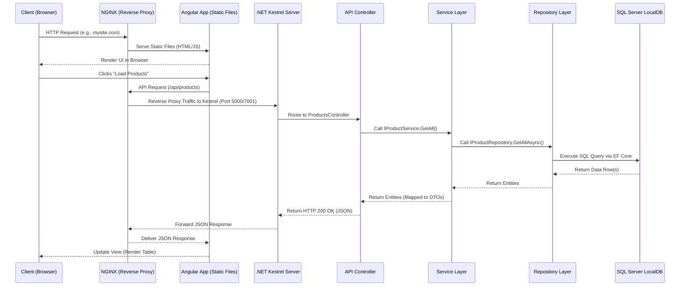

# Full-Stack Guide: .NET 8 & Angular 19

This document serves as an exhaustive reference and demonstration guide for the full-stack `Product Catalog` application. It explores not just *what* was built, but the *why* and *how* behind the architectural choices, language features, and framework capabilities.

---

## 0. Understanding the .NET Solution & Project File Structure

Before writing a single line of C# code, the .NET tooling needs two types of files to understand your application: a **Solution file** and one or more **Project files**. These are not code files — they are configuration/metadata files that tell the compiler and IDE how your application is structured.

---

### The Big Picture: What Problem Do They Solve?

Imagine you are building a house. You need:

1. **A Site Plan** — a top-level blueprint showing how all the buildings on the land relate to each other (which is the main house, which is the garage, which is the guest house).
2. **A Blueprint for each building** — a detailed plan for each individual structure, listing exactly what materials (bricks, wood, steel) are needed.

In .NET, this maps directly:

| Real World                    | .NET Equivalent                             |
| ----------------------------- | ------------------------------------------- |
| Site Plan                     | **Solution file** (`.sln`)          |
| Individual building blueprint | **Project file** (`.csproj`)        |
| Materials list                | **NuGet packages** inside `.csproj` |
| The buildings themselves      | Your C# code folders                        |

---

### The Solution File (`.sln`) — The Workspace Container

**What is it?** A plain text file that lists all the projects belonging to your application. It contains **zero C# code** — it is purely an index of your projects and how they map to build configurations.

**Why does it exist?** When you open Visual Studio or run `dotnet build` from the root of your repository, the tool needs to know: *"Which projects are part of this application, and in what order should I build them?"* The `.sln` file answers that question.

**In our project:** `ProductCatalog.sln` sits at the root and currently knows about:

- `ProductCatalog.Api` — the backend web API
- `ProductCatalog.Api.Tests` — the NUnit test suite

When you run `dotnet test` or `dotnet build` from the root folder, .NET reads the `.sln`, finds all listed projects, and handles them all in the correct dependency order automatically — you don't have to navigate into each folder manually.

Think of the **Solution** file as the outer envelope or container. It does not contain any C# code. Its sole purpose is to **group one or more related projects together** so that IDEs like Visual Studio or VS Code can understand that they belong to the same application.

**Our Solution File:** `ProductCatalog.sln`

```
Microsoft Visual Studio Solution File, Format Version 12.00
# Visual Studio Version 17

Project("{FAE04EC0-...}") = "ProductCatalog.Api",
    "ProductCatalog.Api\ProductCatalog.Api.csproj",
    "{3ECB8EFB-DF2F-48FD-BE47-3F09774BDBE1}"
EndProject
```

**Anatomy of the `.sln` file:**

| Field                                              | Meaning                                                                                                              |
| -------------------------------------------------- | -------------------------------------------------------------------------------------------------------------------- |
| `Format Version 12.00`                           | The internal `.sln` file format version. VS 2019/2022 both use 12.00.                                              |
| `Visual Studio Version 17`                       | The version of Visual Studio this was created with (VS 2022 = Version 17).                                           |
| `Project("{FAE04EC0-...}")`                      | A**Project Type GUID**. This particular GUID (`FAE04EC0`) always means it is a **C# project**.         |
| `"ProductCatalog.Api"`                           | The human-readable name of the project.                                                                              |
| `"ProductCatalog.Api\ProductCatalog.Api.csproj"` | The**relative path** from the `.sln` file to the actual `.csproj` project file.                            |
| `"{3ECB8EFB-...}"`                               | A unique**Project Instance GUID** — randomly generated to identify this specific project within the solution. |
| `SolutionConfigurationPlatforms`                 | Lists all possible build modes: `Debug                                                                               |
| `ProjectConfigurationPlatforms`                  | Maps which build configuration each individual project uses when the solution-level config is selected.              |

> **Key Insight:** When you run `dotnet build` from the root folder pointing at the `.sln` file, .NET reads this file, discovers all listed projects, and builds all of them in the correct dependency order automatically.

---

### The Project File (`.csproj`) — The Build Blueprint

The **Project file** is the heart of a single .NET project. It is an XML file that tells the `dotnet` CLI compiler everything it needs to know: the target framework, which NuGet packages to restore, and how to build the output DLL.

**Project 1 — The API:** `ProductCatalog.Api\ProductCatalog.Api.csproj`

```xml
<Project Sdk="Microsoft.NET.Sdk.Web">

  <PropertyGroup>
    <TargetFramework>net8.0</TargetFramework>   <!-- Target .NET 8 runtime -->
    <Nullable>enable</Nullable>                  <!-- Enable C# nullable reference types -->
    <ImplicitUsings>enable</ImplicitUsings>      <!-- Auto-import common namespaces -->
  </PropertyGroup>

  <ItemGroup>
    <PackageReference Include="AutoMapper" Version="12.0.1" />
    <PackageReference Include="AutoMapper.Extensions.Microsoft.DependencyInjection" Version="12.0.1" />
    <PackageReference Include="Microsoft.EntityFrameworkCore.SqlServer" Version="8.0.0" />
    <PackageReference Include="Microsoft.EntityFrameworkCore.Design" Version="8.0.0">
      <PrivateAssets>all</PrivateAssets>  <!-- Design tools only, not shipped to prod -->
    </PackageReference>
    <PackageReference Include="Microsoft.EntityFrameworkCore.Tools" Version="8.0.0">
      <PrivateAssets>all</PrivateAssets>  <!-- `dotnet ef` CLI tool, not shipped to prod -->
    </PackageReference>
    <PackageReference Include="Swashbuckle.AspNetCore" Version="6.6.2" />
  </ItemGroup>

</Project>
```

**Anatomy of the `.csproj` file:**

| Element                                       | Meaning                                                                                                                                                                                                                                                           |
| --------------------------------------------- | ----------------------------------------------------------------------------------------------------------------------------------------------------------------------------------------------------------------------------------------------------------------- |
| `Sdk="Microsoft.NET.Sdk.Web"`               | Tells MSBuild to use the**Web SDK**, which includes all the defaults for an ASP.NET Core app (Kestrel, Middleware, etc.). A plain class library would use `Microsoft.NET.Sdk`.                                                                            |
| `<TargetFramework>net8.0</TargetFramework>` | The runtime this project will compile against. The output `.dll` will require the .NET 8 runtime to execute.                                                                                                                                                    |
| `<Nullable>enable</Nullable>`               | Enables**Nullable Reference Types** — a C# 8+ safety feature. The compiler will warn you if you try to assign `null` to a non-nullable variable (e.g., `string name = null` will produce a warning).                                                   |
| `<ImplicitUsings>enable</ImplicitUsings>`   | Automatically injects common `using` directives (`System`, `System.Collections.Generic`, `System.Threading.Tasks`, etc.) into every file, so you don't have to write them manually.                                                                       |
| `<PackageReference>`                        | Declares a**NuGet dependency**. When you run `dotnet restore`, the CLI downloads these exact versions from nuget.org into your local cache (`~/.nuget/packages`).                                                                                       |
| `<PrivateAssets>all</PrivateAssets>`        | Marks a package as a**development-only tool**. It is used during development but is NOT bundled into the published output binary. EF Core Design and Tools packages use this because `dotnet ef migrations` is a dev-time command, not needed at runtime. |

---

**Project 2 — The Test Project:** `ProductCatalog.Api.Tests\ProductCatalog.Api.Tests.csproj`

```xml
<Project Sdk="Microsoft.NET.Sdk">   <!-- Plain SDK, not Web SDK -->

  <PropertyGroup>
    <TargetFramework>net9.0</TargetFramework>
    <IsPackable>false</IsPackable>   <!-- Cannot be published as a NuGet package -->
  </PropertyGroup>

  <ItemGroup>
    <PackageReference Include="NUnit" Version="4.2.2" />
    <PackageReference Include="NUnit3TestAdapter" Version="4.6.0" />
    <PackageReference Include="Microsoft.NET.Test.Sdk" Version="17.12.0" />
    <PackageReference Include="Moq" Version="4.20.72" />
    <PackageReference Include="coverlet.collector" Version="6.0.2" />
  </ItemGroup>

  <!-- ✅ This is the KEY line that enables cross-project testing -->
  <ItemGroup>
    <ProjectReference Include="..\ProductCatalog.Api\ProductCatalog.Api.csproj" />
  </ItemGroup>

</Project>
```

**Key differences in the Test project:**

| Element                                    | Why it's different                                                                                                                                                                                                                                                                                               |
| ------------------------------------------ | ---------------------------------------------------------------------------------------------------------------------------------------------------------------------------------------------------------------------------------------------------------------------------------------------------------------- |
| `Sdk="Microsoft.NET.Sdk"` (not `.Web`) | This is a**console-style** project. It doesn't host a web server, so it doesn't need the Web SDK.                                                                                                                                                                                                          |
| `<IsPackable>false</IsPackable>`         | Prevents this test project from accidentally being published as a NuGet package.                                                                                                                                                                                                                                 |
| `<ProjectReference>`                     | This is the critical link. Instead of referencing a published NuGet package, it**directly references the source code** of `ProductCatalog.Api`. This means if you rename a class in the API, the test project immediately picks up the change and shows a compile error — catching bugs before runtime. |
| `NUnit3TestAdapter`                      | Translates NUnit test results into the VSTest protocol so that `dotnet test` and VS Test Explorer can understand and display them.                                                                                                                                                                             |
| `coverlet.collector`                     | A code coverage tool. Running `dotnet test --collect:"XPlat Code Coverage"` produces a `coverage.xml` report showing exactly what percentage of your code is covered by tests.                                                                                                                               |

---

### How They All Connect — The Dependency Graph

```
ProductCatalog.sln          ← The Workspace (no code, just links)
    │
    ├── ProductCatalog.Api          ← Web API (Sdk.Web, net8.0)
    │       ├── AutoMapper
    │       ├── EF Core (SqlServer, Design, Tools)
    │       └── Swashbuckle (Swagger)
    │
    └── ProductCatalog.Api.Tests    ← NUnit Test Runner (Sdk, net9.0)
            ├── NUnit + NUnit3TestAdapter
            ├── Moq
            ├── coverlet.collector
            └── ──→ ProjectReference ──→ ProductCatalog.Api
```

> **Why can the Tests target `net9.0` while the API targets `net8.0`?**
> The .NET runtime is **backwards compatible**. `net9.0` can load and run assemblies compiled for `net8.0`. The test project runs on the newer runtime so it can use the latest NUnit 4 features, while the API deliberately targets `net8.0` LTS for long-term production stability.

---

## What actually happens when you run a .NET application:

𝗦𝘁𝗲𝗽 𝟭: 𝗖𝗼𝗺𝗽𝗶𝗹𝗮𝘁𝗶𝗼𝗻
Your C# code doesn't compile to machine code. It compiles to IL (Intermediate Language) via Roslyn. IL is platform independent, which is why the same .dll runs on Windows, Linux, and macOS. This is the part most people get right.

𝗦𝘁𝗲𝗽 𝟮: 𝗧𝗵𝗲 𝗥𝘂𝗻𝘁𝗶𝗺𝗲 (𝗖𝗼𝗿𝗲𝗖𝗟𝗥)
CoreCLR loads your assembly and does three things: resolves all dependencies, loads types and metadata, and sets up the garbage collector. This is where most startup performance problems live, and most developers never look here.

𝗦𝘁𝗲𝗽 𝟯: 𝗝𝗜𝗧 𝗖𝗼𝗺𝗽𝗶𝗹𝗮𝘁𝗶𝗼𝗻
The JIT compiler converts IL to native machine code, method by method, on first call. That's why the first request to your API is always slower. Tiered compilation helps: Tier 0 compiles fast, then Tier 1 re-compiles hot methods with full optimizations. Dynamic PGO takes it further by using actual runtime data to optimize.

The alternative is NativeAOT, which compiles everything upfront at build time. No JIT, no startup penalty, smaller binaries. Tradeoff: no dynamic code generation.

𝗦𝘁𝗲𝗽 𝟰: 𝗘𝘅𝗲𝗰𝘂𝘁𝗶𝗼𝗻
Your native code runs on the CPU while the GC and Thread Pool work alongside it the entire time:

The GC manages memory in three generations. Gen0 collects short-lived objects (most die here). Gen1 is a buffer. Gen2 holds long-lived objects and is expensive to collect. If your app has Gen2 collection spikes, that's where your latency problems come from.

The Thread Pool manages all your async work. Every time you await something, the Thread Pool decides which thread picks it up next.

𝗪𝗵𝘆 𝘁𝗵𝗶𝘀 𝗺𝗮𝘁𝘁𝗲𝗿𝘀
Understanding this pipeline is the difference between guessing why your app is slow and knowing exactly where to look. Startup slow? Check JIT and assembly loading. Random latency spikes? Check GC Gen2 collections. High memory? Check object lifetimes.


## 1. The Technology Choices: Why .NET and Angular?

### Why .NET 8 for the Backend?

.NET has undergone a massive evolution since the legacy .NET Framework days. .NET Core (and now simply .NET 5+) represents a unified, cross-platform, high-performance ecosystem. .NET 8 is an LTS (Long Term Support) release, making it the industry standard for enterprise backends.

**Key .NET 8 Capabilities & Features:**

- **Extreme Performance:** .NET 8 includes optimizations to the JIT compiler, garbage collection, and raw string JSON serialization, making ASP.NET Core one of the fastest web frameworks on the TechEmpower benchmarks.
- **Cross-Platform:** Write once, run on Windows, Linux, or macOS seamlessly.
- **Native AOT (Ahead-of-Time) Compilation:** Allows apps to compile directly to native code, resulting in near-instant startup times and significantly reduced memory footprints.
- **Dependency Injection (DI):** First-class, built-in DI promotes decoupled, testable code without relying on heavy third-party libraries (like Ninject or Autofac from older eras).
- **Minimal APIs & Controllers:** Offers both lightweight Minimal APIs for microservices and traditional MVC Controllers for structured enterprise REST APIs.
- **Rich Ecosystem:** Tools like AutoMapper (for DTOs) and Entity Framework Core (for ORM) provide a robust, mature developer experience.

### Why Angular 19 for the Frontend?

Angular is a platform designed by Google specifically for scalable, enterprise-grade applications. While React is a "library" where developers stitch together third-party packages, Angular provides a cohesive, heavily-opinionated framework out-of-the-box.

**Key Angular 19 Capabilities & Features:**

- **Standalone Components:** The legacy `NgModule` system is gone. Components, Directives, and Pipes are now `standalone`, making the application lighter, easier to read, and faster to compile.
- **Signals:** Angular 19 heavily embraces Signals for fine-grained reactivity. Unlike RxJS Observables, Signals track state synchronously and only update the exact DOM nodes that changed, removing the need for `Zone.js` overhead in the future.
- **Built-in Control Flow:** Angular 17+ introduced a new templating syntax (`@if`, `@for`, `@switch`) that replaces `*ngIf` and `*ngFor`. It is up to 90% faster during runtime execution.
- **Server-Side Rendering (SSR) & Hydration:** Out-of-the-box non-destructive hydration improves First Contentful Paint (FCP) and SEO metrics drastically.
- **Fetch API Integration:** `HttpClient` now uses the native `fetch` API behind the scenes, improving performance and modernizing network requests.
- **Strict TypeScript:** Built on TS, Angular enforces strict typing, interfaces, and object shapes, drastically reducing runtime bugs.

---

## 2. Deep Dive: Solution Architecture

### Architectural Diagram & Request Pipeline

In a production environment, requests traverse a robust pipeline starting from a reverse proxy down to the database. The diagram below illustrates this flow.



### The Request Pipeline Explained (Starting with NGINX)

1. **NGINX (The Entry Point):** In a production scenario, NGINX acts as the public-facing web server and reverse proxy. It serves two primary roles:
   - **Static File Hosting:** It serves the compiled Angular application files (`index.html`, JavaScript bundles, CSS).
   - **Reverse Proxy:** It intercepts calls destined for the API (e.g., `mysite.com/api/...`) and securely forwards them to the internal .NET Core Kestrel server. This protects the backend from direct exposure and allows NGINX to handle SSL termination, load balancing, and rate limiting.
2. **Angular UI (Client Execution):** Once the browser downloads the Angular files from NGINX, the application boots up locally on the user's machine. User interactions trigger API calls using the `HttpClient`.
3. **.NET Kestrel Server:** The cross-platform web server included with ASP.NET Core receives the forwarded request from NGINX and hands it off to the ASP.NET Core request pipeline (Middleware).
4. **API Controllers & Services:** The Controller receives the HTTP request, unpacks it, and delegates the business logic to the injected Service Layer.
5. **EF Core & Database:** The Repository interacts with Entity Framework Core to generate the necessary SQL, executes it against the SQL Server Database, and propagates the resulting data all the way back up the chain.

### The Clean Architecture Philosophy

Our backend relies on "Clean Architecture" principles. The goal is the **Separation of Concerns**. The database should not dictate the business logic, and the API payload should not dictate the database schema.

1. **Entity Framework Core (The ORM):**

   - We use **Code-First** development. We write C# classes (`Product.cs`), and EF Core's Migration tool translates that into a SQL Server database schema.
   - **Why?** It keeps the database schema version-controlled within Git and allows developers to stay entirely within C# without writing raw SQL.
2. **Repository Pattern (`IProductRepository` & `ProductRepository`):**

   - **What it does:** Abstracts the direct `DbContext` calls.
   - **Why?** If we ever swap SQL Server for MongoDB, or EF Core for Dapper, the rest of the application doesn't care. It also makes unit testing incredibly easy because we can "mock" the repository interface.
3. **Service Layer (`IProductService` & `ProductService`):**

   - **What it does:** The "brain" of the app. It takes data from the Repository, applies business rules (like checking if a product exists before deleting), and passes it to the Controller.
   - **Why?** Controllers should be "dumb." They should only handle HTTP concerns (status codes, route parsing) and delegate work to Services.
4. **DTOs (Data Transfer Objects) & AutoMapper:**

   - **What they are:** Objects specifically shaped for the API (`ProductCreateDto`).
   - **Why?** *Over-posting attacks.* If our `Product` entity has a `CreatedAt` or `IsApproved` flag, a malicious user could pass `IsApproved: true` in the JSON body of an endpoint. By using DTOs, we control exactly which fields can be read or mutated. AutoMapper handles the tedious `entity.Name = dto.Name` mapping automatically.

### How this maps to the MVC (Model-View-Controller) Architecture

While traditional MVC (like classic ASP.NET MVC or Ruby on Rails) rendered HTML directly from the server, modern full-stack applications use a **Distributed MVC** pattern:

* **Model (Data & Business Logic):**
  * *Backend:* The C# `Product` Entity, the `CatalogDbContext`, and the Service Layer encapsulate the core business rules and database state.
  * *Frontend:* The TypeScript `Product` interface and RxJS Observables in the Angular `ProductService` hold the client-side state of the model.
* **View (Presentation):**
  * *Frontend Only:* The View is entirely handled by Angular. The HTML templates (e.g., `product-list.component.html`) and Bootstrap CSS dictate how the Model is presented to the user. The backend API is completely headless (it returns JSON, not HTML).
* **Controller (Routing & Orchestration):**
  * *Backend:* The `ProductsController` in .NET acts as the API Controller. It listens to HTTP requests (GET, POST), routes them to the appropriate Service, and returns the correct HTTP status code.
  * *Frontend:* The Angular Component classes (e.g., `product-list.component.ts`) act as client-side controllers. They handle user interactions (like clicking "Delete"), invoke the Service to update the backend, and then update the local Model to refresh the View.

---

## 3. Application Architecture (Directory Structure & Layer Details)

Understanding the physical layout of the codebase is crucial. This full-stack application relies on two distinct projects hosted in a single repository for demonstration purposes.

### Backend (.NET API)

The `.NET` application follows a feature-grouped clean architecture structure:

```text
ProductCatalog.Api/
├── Controllers/
│   └── ProductsController.cs       # API entry points (GET, POST, PUT, DELETE)
├── Data/
│   ├── CatalogDbContext.cs         # EF Core Database Session & configuration
│   └── Migrations/                 # Auto-generated SQL schema versions
├── Domain/
│   └── Product.cs                  # The core C# Entity (Database Table shape)
├── DTOs/
│   └── ProductDto.cs               # Network payloads (prevent over-posting)
├── Mapping/
│   └── MappingProfile.cs           # AutoMapper config (Entity <-> DTO)
├── Repositories/
│   ├── IProductRepository.cs       # Contract for database actions
│   └── ProductRepository.cs        # Concrete EF Core data access
├── Services/
│   ├── IProductService.cs          # Contract for business logic
│   └── ProductService.cs           # Concrete business logic & validation
└── Program.cs                      # Application bootstrapper & DI container
```

#### Detailed Breakdown:

- **Domain:** This is the absolute core of the application. It contains C# classes (Entities) that represent the business objects. These classes should have zero dependencies on web frameworks or databases.
- **Data & Repositories:** This layer handles persistence. `CatalogDbContext` is the bridge to SQL Server. The `Repositories` wrap the EF Core logic so that the rest of the application doesn't have to write LINQ queries.
- **Services:** This layer orchestrates business logic. If a product needs specific validation before being saved, or if an email needs to be sent when a product is created, that logic lives here.
- **Controllers & DTOs:** This is the presentation layer of the API. Controllers parse incoming HTTP requests and pass the data to the Services. DTOs (Data Transfer Objects) are used here to ensure that internal Domain models are never exposed directly to the outside world, preventing security vulnerabilities.

### Frontend (Angular 19 UI)

The `Angular` application uses a modern feature-based structure, eliminating the old `app.module.ts` in favor of standalone components.

```text
product-catalog-ui/
├── public/
│   └── favicon.ico                 # Static public assets
└── src/
    ├── app/
    ├── core/
    │   └── services/               # Singleton API services (ProductService)
    ├── features/
    │   └── products/               # Feature Module: Products
    │       ├── product-list/       # View: Table of products
    │       └── product-form/       # View: Add/Edit reactive form
    ├── shared/
    │   └── models/                 # Reusable Typescript Interfaces (Product)
    ├── app.component.ts            # Root layout (Navbar & RouterOutlet shell)
    ├── app.config.ts               # Global providers (HttpClient, Router)
    └── app.routes.ts               # URL path mapping for lazy loading
    ├── environments/               # Dev/Prod API URL configs
    ├── index.html                  # Main HTML file (loads Bootstrap via CDN)
    ├── main.ts                     # Angular bootstrapping entry point
    └── styles.scss                 # Global application CSS/SCSS styling
```

#### Detailed Breakdown:

- **Core:** The `core` folder is for singleton services that are instantiated once and shared across the entire application (e.g., `ProductService` which handles all `HttpClient` calls to the .NET API).
- **Features:** The `features` folder breaks the application down by domain (e.g., `products`, `users`, `orders`). Inside `products`, we have specific, self-contained components like the `product-list` and the `product-form`. This makes the application highly scalable and easy to navigate.
- **Shared:** The `shared` folder contains reusable code that doesn't belong to any specific feature. In our case, the `product.model.ts` interfaces are stored here so both the Core services and Feature components can import them.
- **App Shell (`app.component.ts` & `app.routes.ts`):** These files bootstrap the UI. The routing configuration determines which component to load based on the URL, and the `app.component` provides the persistent layout (like the Navbar and Footer) that surrounds the routed content.

---

## 4. Detailed Commit History & Explanations

The project was constructed following a strict "atomic commit" strategy. Each commit represents a single, verifiable logical change.

### Commit 1: `feat: create ASP.NET Core Web API solution`

- **Features:** Initialized the `.NET 8` Web API template using `dotnet new webapi`.
- **Explanation:** This sets up the foundational `Program.cs`, the host builder, and standard middleware like Swagger (OpenAPI) for API documentation.

### Commit 2: `feat: add Product entity and EF Core DbContext`

- **Features:** Created the `Product` Domain Entity and `CatalogDbContext`.
- **Explanation:** We defined the shape of our data. `Product.cs` contains the properties (Id, Name, Price, Description), and `CatalogDbContext` tells Entity Framework that this class maps to a `Products` table in the database.

### Commit 3: `feat: add initial migration and database creation`

- **Features:** Executed `dotnet ef migrations add InitialCreate`.
- **Explanation:** This translated our C# `Product` class into a SQL `CREATE TABLE` script. We configured the application to automatically run this migration against LocalDB when the application starts, ensuring the database is always ready.

### Commit 4: `feat: implement repository and service layers`

- **Features:** Created `IProductRepository`, `ProductRepository`, `IProductService`, and `ProductService`. Registered them in `Program.cs` via DI.
- **Explanation:** This implemented our clean architecture. By registering them as `AddScoped`, .NET's Dependency Injection container automatically provides these classes to any controller that asks for them, ensuring they share the same database transaction lifecycle per HTTP request.

### Commit 5: `feat: add ProductController, DTOs, and AutoMapper`

- **Features:** Created the RESTful endpoints (`GET`, `POST`, `PUT`, `DELETE`). Added AutoMapper profiles. Configured CORS.
- **Explanation:** We created the actual API contract. The controller receives an HTTP request, delegates to the `ProductService`, maps the result to a `ProductDto` via AutoMapper, and returns an `IActionResult` (like `200 OK` or `404 Not Found`). CORS was configured so our future Angular app on port `4200` could bypass browser security blocks.

### Commit 6: `feat(ui): add Angular 19 workspace and configuration`

- **Features:** Ran `ng new product-catalog-ui` using Angular 19.
- **Explanation:** Scaffolded the modern frontend utilizing `Standalone Components` (no ngModules) and the `Vite`-based build system for ultra-fast compilation.

### Commit 7: `feat(ui): add Angular models, environments, and ProductService`

- **Features:** Created TypeScript interfaces matching the C# DTOs, and built the Angular `ProductService` using `HttpClient`.
- **Explanation:** This established the frontend's communication layer. TypeScript interfaces ensure compile-time safety (preventing typos like `product.Nmae`), and the Service centralized all API calls so components remain clean.

### Commit 8: `feat(ui): add Angular product components and routing`

- **Features:** Built `ProductListComponent` and `ProductFormComponent`. Setup lazy-loaded routes in `app.routes.ts`. Added Bootstrap 5.
- **Explanation:**
  - **Routing:** Navigating to `/products/new` loads the Form component lazily, keeping the initial payload small.
  - **List Component:** Showcases the new Angular `@for` and `@if` control flow to render a dynamic HTML table.
  - **Form Component:** Utilizes **Reactive Forms**, providing robust validation (checking `Validators.required` and `Validators.min`) entirely in TypeScript before the data ever hits the API.

---

## 5. Key Takeaways & Enterprise Best Practices Implemented

1. **Strict TypeScript & C# Typing:** Every layer of the application knows exactly what data it is dealing with. There are no `any` types or untyped dynamic objects.
2. **Graceful Error Handling:** Both the Angular UI and the .NET API handle "Not Found" scenarios gracefully, showing user-friendly messages instead of raw stack traces.
3. **Responsive UI:** Using Bootstrap 5, the application is inherently mobile-responsive and accessible.
4. **Separation of Concerns:** From the Repository pattern in the backend to the Service architecture in the frontend, logic is heavily abstracted, making the codebase scalable for dozens of developers to work on simultaneously.

---

## 6. Quick Start: How to Run the Project (From Scratch)

If you are a new developer cloning this repository for the first time, follow these exact steps and terminal commands to get both the backend and frontend running on your local machine.

### Prerequisites

Ensure you have the following installed on your machine:

- [.NET 8 SDK](https://dotnet.microsoft.com/en-us/download/dotnet/8.0)
- [Node.js](https://nodejs.org/) (v24 or later recommended)
- SQL Server LocalDB (comes with Visual Studio, or installed via SQL Server Express)
- Git

### Step 1: Clone the Repository

Open PowerShell or your preferred terminal and run:

```bash
# Clone the project to your local machine
git clone <your-repository-url>
cd ProductCatalog
```

### Step 2: Start the Backend (.NET 8 Web API)

Open a terminal in the root `ProductCatalog` folder:

```bash
# Navigate to the API directory
cd ProductCatalog.Api

# Restore Nuget dependencies
dotnet restore

# Run the Entity Framework database migrations to create the local DB
dotnet ef database update

# Start the .NET API server (Swagger will be available at https://localhost:7001/swagger)
dotnet run
```

*(Leave this terminal window open so the API continues running).*

### Step 3: Start the Frontend (Angular 19 UI)

Open a **new** terminal window in the root `ProductCatalog` folder:

```bash
# Navigate to the Angular UI directory
cd product-catalog-ui

# Install all Node.js dependencies
npm install

# Start the Angular development server
npm start
```

### Step 4: Access the Application

- Open your browser and navigate to: **[http://localhost:4200](http://localhost:4200)**
- You should now see the Product Catalog UI. You can Add, Edit, View, and Delete products. All changes will persist to the SQL Server LocalDB via the .NET API.

---

## 7. First-Time Learner's Handbook: Common Pitfalls & Debugging Tips

If you are new to full-stack development, jumping into a typed language like C# alongside a heavily opinionated framework like Angular can feel overwhelming. Below are the most common hurdles you might encounter and how to overcome them.

### 1. The CORS Error (Cross-Origin Resource Sharing)

**The Problem:** You try to load the Angular app, but no data appears. You open the Browser Developer Tools (F12) and see a red error in the Console mentioning `CORS policy`.
**Why it happens:** Browsers have a built-in security feature that prevents a website on one domain (e.g., `localhost:4200`) from requesting data from another domain (e.g., `localhost:7001`) unless the server explicitly allows it.
**The Fix:** Ensure your `.NET Program.cs` file has the CORS middleware configured and applied (`app.UseCors()`), specifically allowing the `http://localhost:4200` origin.

### 2. The Dreaded "Null Reference" or "Undefined"

**The Problem (C#):** `System.NullReferenceException: Object reference not set to an instance of an object.`
**The Problem (Angular):** `TypeError: Cannot read properties of undefined (reading 'name')`
**Why it happens:** You are trying to access a property on a variable that currently holds nothing (`null` or `undefined`). In Angular, this often happens when you try to render data in the HTML template before the asynchronous API call has finished fetching it.
**The Fix:**

- In C#, utilize the debugger in Visual Studio/VS Code to step through your code and see exactly which object is null. Use the `?` null-conditional operator (e.g., `product?.Name`).
- In Angular, use the `@if` control flow to only render the component *after* the data is loaded, or use the optional chaining operator in your templates (`{{ product?.name }}`).

### 3. Understanding Asynchronous Programming (Promises vs. Observables vs. async/await)

Because web applications rely heavily on network requests and database queries, your code cannot simply "stop and wait" for a response. It must be asynchronous.

- **In .NET (C#):** We use `async` and `await` alongside `Task<T>`. When the repository queries the database (`await dbContext.Products.ToListAsync()`), the server thread is freed up to handle other users' requests until the database finishes its job.
- **In Angular (TypeScript):** While JavaScript uses `Promises` for async work, Angular heavily utilizes **RxJS Observables**. An Observable is like a stream of data over time. When you call `http.get()`, it doesn't do anything until you `.subscribe()` to it.
  > **Pro-Tip:** Always remember to `.subscribe()` to your HTTP calls in Angular, otherwise, the network request is never actually sent!
  >

### 4. Debugging Like a Pro

Don't rely purely on `console.log()` or `Console.WriteLine()`.

- **For the Frontend:** Open Chrome DevTools (F12).
  - The **Console** tab shows Javascript errors.
  - The **Network** tab is your best friend. Click on an API request to see the exact JSON payload you sent to the server, and the exact JSON response (or error status code) the server sent back.
- **For the Backend:** Use the integrated debugger in Visual Studio or VS Code. Set a breakpoint (a red dot next to the line number) inside your Controller. When you click a button in Angular, your backend code will pause execution exactly at that line, allowing you to inspect variables in real-time.

### 5. Forgetting to Migrate the Database

**The Problem:** `SqlException: Invalid object name 'Products'.`
**Why it happens:** You wrote the C# `Product` entity, but you forgot to tell SQL Server to actually create the table.
**The Fix:** Always run `dotnet ef migrations add <Name>` and `dotnet ef database update` whenever you change the shape of your data in C#.

---

## 8. Unit Testing & Test-Driven Development (TDD)

Writing reliable software requires automated tests to ensure that changes do not break existing functionality. We have implemented Unit Testing in the `.NET Backend` using **NUnit** and **Moq**.

### The "Arrange, Act, Assert" (AAA) Pattern

Our tests follow the standard AAA pattern to ensure readability:

1. **Arrange:** Set up the test conditions, declare variables, and configure any mock objects.
2. **Act:** Execute the exact method you are trying to test.
3. **Assert:** Verify that the result matches your expected outcome.

### Mocking Dependencies with "Moq"

A "Unit Test" must be completely isolated. We should *not* hit the real SQL Server database during a unit test because database states change, leading to flaky tests.

Instead, we use a library called **Moq**. Moq allows us to create a "fake" `IProductRepository` that returns hard-coded data in memory. This allows us to perfectly isolate the `ProductService` and test *only* the business logic (like ensuring mapping occurs properly).

### How to Run the Tests

To execute the test suite, open a terminal in the root `ProductCatalog` folder and run:

```bash
cd ProductCatalog.Api.Tests
dotnet test
```

This will automatically compile the test project, execute the NUnit test suite, and print a pass/fail report to your terminal!

---

## 9. Enterprise Enhancements

To take this project from a "learning demo" to a production-ready template, we've implemented the following enterprise features:

### Global Exception Handling (.NET 8 `IExceptionHandler`)

Instead of letting the application crash and return an ugly HTML stack trace to the Angular client when a database connection fails, we implemented a **Global Exception Handler Middleware**.

- Located in `Middleware/GlobalExceptionHandler.cs`.
- It acts as a safety net wrapped around the entire API.
- Any unhandled exception is caught, logged securely using `ILogger`, and a clean, standard RFC 7807 `ProblemDetails` JSON response (Status 500) is sent to the client.

### The Automated Startup Pipeline (`run-app.bat`)

Running the API and UI in separate terminals manually can be tedious. We built a local pipeline script `run-app.bat` located in the root folder.
When you execute `run-app.bat`:

1. **Port Cleanup:** It uses `netstat` and `taskkill` to forcefully shut down any orphaned `.NET` or `Node` processes lingering on ports 5190, 7001, or 4200.
2. **Concurrent Boot:** It uses the Windows `start` command to spawn two independent command prompt windows—one running `dotnet run` and the other running `npm start`.
3. **Seamless DX (Developer Experience):** You can boot your entire full-stack ecosystem with a single click, totally eliminating "port already in use" errors!
