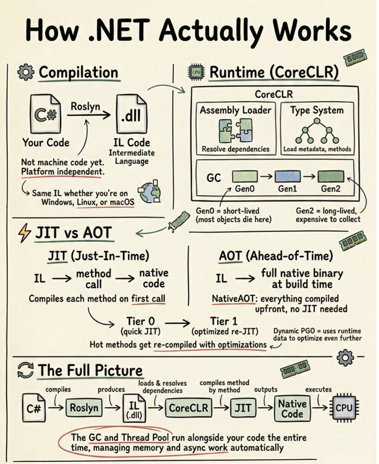
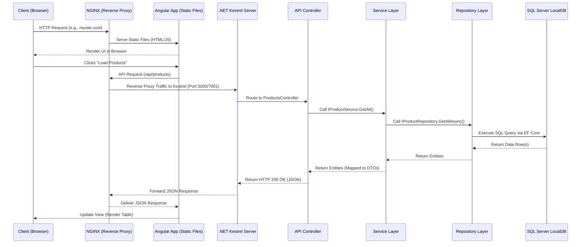

# Full-Stack Guide: .NET 8 & Angular 19

This document serves as an exhaustive reference and demonstration guide for the full-stack `Product Catalog` application. It explores not just *what* was built, but the *why* and *how* behind the architectural choices, language features, and framework capabilities.

---

## 0. Understanding the .NET Solution & Project File Structure

Before writing a single line of C# code, the .NET tooling needs two types of files to understand your application: a **Solution file** and one or more **Project files**. These are not code files — they are configuration/metadata files that tell the compiler and IDE how your application is structured.

---

### The Big Picture: What Problem Do They Solve?

Imagine you are building a house. You need:

1. **A Site Plan** — a top-level blueprint showing how all the buildings on the land relate to each other (which is the main house, which is the garage, which is the guest house).
2. **A Blueprint for each building** — a detailed plan for each individual structure, listing exactly what materials (bricks, wood, steel) are needed.

In .NET, this maps directly:

| Real World                    | .NET Equivalent                             |
| ----------------------------- | ------------------------------------------- |
| Site Plan                     | **Solution file** (`.sln`)          |
| Individual building blueprint | **Project file** (`.csproj`)        |
| Materials list                | **NuGet packages** inside `.csproj` |
| The buildings themselves      | C# code folders                             |

---

### The Solution File (`.sln`) — The Workspace Container

**What is it?** A plain text file that lists all the projects belonging to application. It contains **zero C# code** — it is purely an index of your projects and how they map to build configurations.

**Why does it exist?** When you open Visual Studio or run `dotnet build` from the root of your repository, the tool needs to know: *"Which projects are part of this application, and in what order should I build them?"* The `.sln` file answers that question.

**In our project:** `ProductCatalog.sln` sits at the root and currently knows about:

- `ProductCatalog.Api` — the backend web API
- `ProductCatalog.Api.Tests` — the NUnit test suite

When you run `dotnet test` or `dotnet build` from the root folder, .NET reads the `.sln`, finds all listed projects, and handles them all in the correct dependency order automatically — you don't have to navigate into each folder manually.

Think of the **Solution** file as the outer envelope or container. It does not contain any C# code. Its sole purpose is to **group one or more related projects together** so that IDEs like Visual Studio or VS Code can understand that they belong to the same application.

**Our Solution File:** `ProductCatalog.sln`

```
Microsoft Visual Studio Solution File, Format Version 12.00
# Visual Studio Version 17

Project("{FAE04EC0-...}") = "ProductCatalog.Api",
    "ProductCatalog.Api\ProductCatalog.Api.csproj",
    "{3ECB8EFB-DF2F-48FD-BE47-3F09774BDBE1}"
EndProject
```

**Anatomy of the `.sln` file:**

| Field                                              | Meaning                                                                                                              |
| -------------------------------------------------- | -------------------------------------------------------------------------------------------------------------------- |
| `Format Version 12.00`                           | The internal`.sln` file format version. VS 2019/2022 both use 12.00.                                               |
| `Visual Studio Version 17`                       | The version of Visual Studio this was created with (VS 2022 = Version 17).                                           |
| `Project("{FAE04EC0-...}")`                      | A**Project Type GUID**. This particular GUID (`FAE04EC0`) always means it is a **C# project**.         |
| `"ProductCatalog.Api"`                           | The human-readable name of the project.                                                                              |
| `"ProductCatalog.Api\ProductCatalog.Api.csproj"` | The**relative path** from the `.sln` file to the actual `.csproj` project file.                            |
| `"{3ECB8EFB-...}"`                               | A unique**Project Instance GUID** — randomly generated to identify this specific project within the solution. |
| `SolutionConfigurationPlatforms`                 | Lists all possible build modes: `Debug                                                                               |
| `ProjectConfigurationPlatforms`                  | Maps which build configuration each individual project uses when the solution-level config is selected.              |

> **Key Insight:** When you run `dotnet build` from the root folder pointing at the `.sln` file, .NET reads this file, discovers all listed projects, and builds all of them in the correct dependency order automatically.

---

### The Project File (`.csproj`) — The Build Blueprint

The **Project file** is the heart of a single .NET project. It is an XML file that tells the `dotnet` CLI compiler everything it needs to know: the target framework, which NuGet packages to restore, and how to build the output DLL.

**Project 1 — The API:** `ProductCatalog.Api\ProductCatalog.Api.csproj`

```xml
<Project Sdk="Microsoft.NET.Sdk.Web">

  <PropertyGroup>
    <TargetFramework>net8.0</TargetFramework>   <!-- Target .NET 8 runtime -->
    <Nullable>enable</Nullable>                  <!-- Enable C# nullable reference types -->
    <ImplicitUsings>enable</ImplicitUsings>      <!-- Auto-import common namespaces -->
  </PropertyGroup>

  <ItemGroup>
    <PackageReference Include="AutoMapper" Version="12.0.1" />
    <PackageReference Include="Microsoft.EntityFrameworkCore.SqlServer" Version="8.0.0" />
    <PackageReference Include="Microsoft.EntityFrameworkCore.Design" Version="8.0.0">
      <IncludeAssets>runtime; build; native; contentfiles; analyzers; buildtransitive</IncludeAssets>
      <PrivateAssets>all</PrivateAssets>  <!-- Design tools only, not shipped to prod -->
    </PackageReference>
    <PackageReference Include="Microsoft.EntityFrameworkCore.Tools" Version="8.0.0">
      <IncludeAssets>runtime; build; native; contentfiles; analyzers; buildtransitive</IncludeAssets>
      <PrivateAssets>all</PrivateAssets>  <!-- `dotnet ef` CLI tool, not shipped to prod -->
    </PackageReference>
    <PackageReference Include="Swashbuckle.AspNetCore" Version="6.6.2" />
  </ItemGroup>

</Project>
```

**Anatomy of the `.csproj` file:**

| Element                                       | Meaning                                                                                                                                                                                                                                                           |
| --------------------------------------------- | ----------------------------------------------------------------------------------------------------------------------------------------------------------------------------------------------------------------------------------------------------------------- |
| `Sdk="Microsoft.NET.Sdk.Web"`               | Tells MSBuild to use the**Web SDK**, which includes all the defaults for an ASP.NET Core app (Kestrel, Middleware, etc.). A plain class library would use `Microsoft.NET.Sdk`.                                                                            |
| `<TargetFramework>net8.0</TargetFramework>` | The runtime this project will compile against. The output`.dll` will require the .NET 8 runtime to execute.                                                                                                                                                     |
| `<Nullable>enable</Nullable>`               | Enables**Nullable Reference Types** — a C# 8+ safety feature. The compiler will warn you if you try to assign `null` to a non-nullable variable (e.g., `string name = null` will produce a warning).                                                   |
| `<ImplicitUsings>enable</ImplicitUsings>`   | Automatically injects common`using` directives (`System`, `System.Collections.Generic`, `System.Threading.Tasks`, etc.) into every file, so you don't have to write them manually.                                                                        |
| `<PackageReference>`                        | Declares a**NuGet dependency**. When you run `dotnet restore`, the CLI downloads these exact versions from nuget.org into your local cache (`~/.nuget/packages`).                                                                                       |
| `<PrivateAssets>all</PrivateAssets>`        | Marks a package as a**development-only tool**. It is used during development but is NOT bundled into the published output binary. EF Core Design and Tools packages use this because `dotnet ef migrations` is a dev-time command, not needed at runtime. |

---

**Project 2 — The Test Project:** `ProductCatalog.Api.Tests\ProductCatalog.Api.Tests.csproj`

```xml
<Project Sdk="Microsoft.NET.Sdk">   <!-- Plain SDK, not Web SDK -->

  <PropertyGroup>
    <TargetFramework>net9.0</TargetFramework>
    <IsPackable>false</IsPackable>   <!-- Cannot be published as a NuGet package -->
  </PropertyGroup>

  <ItemGroup>
    <PackageReference Include="NUnit" Version="4.2.2" />
    <PackageReference Include="NUnit3TestAdapter" Version="4.6.0" />
    <PackageReference Include="Microsoft.NET.Test.Sdk" Version="17.12.0" />
    <PackageReference Include="Moq" Version="4.20.72" />
    <PackageReference Include="coverlet.collector" Version="6.0.2" />
  </ItemGroup>

  <!-- ✅ This is the KEY line that enables cross-project testing -->
  <ItemGroup>
    <ProjectReference Include="..\ProductCatalog.Api\ProductCatalog.Api.csproj" />
  </ItemGroup>

</Project>
```

**Key differences in the Test project:**

| Element                                    | Why it's different                                                                                                                                                                                                                                                                                               |
| ------------------------------------------ | ---------------------------------------------------------------------------------------------------------------------------------------------------------------------------------------------------------------------------------------------------------------------------------------------------------------- |
| `Sdk="Microsoft.NET.Sdk"` (not `.Web`) | This is a**console-style** project. It doesn't host a web server, so it doesn't need the Web SDK.                                                                                                                                                                                                          |
| `<IsPackable>false</IsPackable>`         | Prevents this test project from accidentally being published as a NuGet package.                                                                                                                                                                                                                                 |
| `<ProjectReference>`                     | This is the critical link. Instead of referencing a published NuGet package, it**directly references the source code** of `ProductCatalog.Api`. This means if you rename a class in the API, the test project immediately picks up the change and shows a compile error — catching bugs before runtime. |
| `NUnit3TestAdapter`                      | Translates NUnit test results into the VSTest protocol so that`dotnet test` and VS Test Explorer can understand and display them.                                                                                                                                                                              |
| `coverlet.collector`                     | A code coverage tool. Running`dotnet test --collect:"XPlat Code Coverage"` produces a `coverage.xml` report showing exactly what percentage of your code is covered by tests.                                                                                                                                |

---

### How They All Connect — The Dependency Graph

```
ProductCatalog.sln          ← The Workspace (no code, just links)
    │
    ├── ProductCatalog.Api          ← Web API (Sdk.Web, net8.0)
    │       ├── AutoMapper
    │       ├── EF Core (SqlServer, Design, Tools)
    │       └── Swashbuckle (Swagger)
    │
    └── ProductCatalog.Api.Tests    ← NUnit Test Runner (Sdk, net9.0)
            ├── NUnit + NUnit3TestAdapter
            ├── Moq
            ├── coverlet.collector
            └── ──→ ProjectReference ──→ ProductCatalog.Api
```

> **Why can the Tests target `net9.0` while the API targets `net8.0`?**
> The .NET runtime is **backwards compatible**. `net9.0` can load and run assemblies compiled for `net8.0`. The test project runs on the newer runtime so it can use the latest NUnit 4 features, while the API deliberately targets `net8.0` LTS for long-term production stability.

---

## What actually happens when you run a .NET application:

𝗦𝘁𝗲𝗽 𝟭: 𝗖𝗼𝗺𝗽𝗶𝗹𝗮𝘁𝗶𝗼𝗻
Your C# code doesn't compile to machine code. It compiles to IL (Intermediate Language) via Roslyn. IL is platform independent, which is why the same .dll runs on Windows, Linux, and macOS.

𝗦𝘁𝗲𝗽 𝟮: 𝗧𝗵𝗲 𝗥𝘂𝗻𝘁𝗶𝗺𝗲 (𝗖𝗼𝗿𝗲𝗖𝗟𝗥)
CoreCLR loads your assembly and does three things: resolves all dependencies, loads types and metadata, and sets up the garbage collector. This is where most startup performance problems live, and most developers never look here.

𝗦𝘁𝗲𝗽 𝟯: 𝗝𝗜𝗧 𝗖𝗼𝗺𝗽𝗶𝗹𝗮𝘁𝗶𝗼𝗻
The JIT compiler converts IL to native machine code, method by method, on first call. That's why the first request to API is always slower. Tiered compilation helps: Tier 0 compiles fast, then Tier 1 re-compiles hot methods with full optimizations. Dynamic PGO takes it further by using actual runtime data to optimize.

The alternative is NativeAOT, which compiles everything upfront at build time. No JIT, no startup penalty, smaller binaries. Tradeoff: no dynamic code generation.

𝗦𝘁𝗲𝗽 𝟰: 𝗘𝘅𝗲𝗰𝘂𝘁𝗶𝗼𝗻
Native code runs on the CPU while the GC and Thread Pool work alongside it the entire time:

The GC manages memory in three generations. Gen0 collects short-lived objects (most die here). Gen1 is a buffer. Gen2 holds long-lived objects and is expensive to collect. If your app has Gen2 collection spikes, that's where your latency problems come from.

The Thread Pool manages all your async work. Every time you await something, the Thread Pool decides which thread picks it up next.

𝗪𝗵𝘆 𝘁𝗵𝗶𝘀 𝗺𝗮𝘁𝘁𝗲𝗿𝘀
Understanding this pipeline is the difference between guessing why your app is slow and knowing exactly where to look. Startup slow? Check JIT and assembly loading. Random latency spikes? Check GC Gen2 collections. High memory? Check object lifetimes.



## 1. The Technology Choices: Why .NET and Angular?

### Why .NET 8 for the Backend?

.NET has undergone a massive evolution since the legacy .NET Framework days. .NET Core (and now simply .NET 5+) represents a unified, cross-platform, high-performance ecosystem. .NET 8 is an LTS (Long Term Support) release, making it the industry standard for enterprise backends.

**Key .NET 8 Capabilities & Features:**

- **Extreme Performance:** .NET 8 includes optimizations to the JIT compiler, garbage collection, and raw string JSON serialization, making ASP.NET Core one of the fastest web frameworks on the TechEmpower benchmarks.
- **Cross-Platform:** Write once, run on Windows, Linux, or macOS seamlessly.
- **Native AOT (Ahead-of-Time) Compilation:** Allows apps to compile directly to native code, resulting in near-instant startup times and significantly reduced memory footprints.
- **Dependency Injection (DI):** First-class, built-in DI promotes decoupled, testable code without relying on heavy third-party libraries (like Ninject or Autofac from older eras).
- **Minimal APIs & Controllers:** Offers both lightweight Minimal APIs for microservices and traditional MVC Controllers for structured enterprise REST APIs.
- **Rich Ecosystem:** Tools like AutoMapper (for DTOs) and Entity Framework Core (for ORM) provide a robust, mature developer experience.

> **What is `ImplicitUsings`?** When `<ImplicitUsings>enable</ImplicitUsings>` is set in the `.csproj`, the SDK injects a hidden file (`GlobalUsings.g.cs`) into your build that pre-imports the most common namespaces: `System`, `System.Collections.Generic`, `System.IO`, `System.Linq`, `System.Net.Http`, `System.Threading`, `System.Threading.Tasks`, and several ASP.NET Core ones. Without this, every `.cs` file would need a dozen `using` statements at the top. With it, those namespaces are always available everywhere — you write `Task<T>` or `IEnumerable<T>` without any import.

> **What is `<Nullable>enable</Nullable>`?** C# was originally designed where *any* reference type variable could hold `null`. This caused billions of `NullReferenceException` crashes across the industry. C# 8.0 introduced **Nullable Reference Types** (NRT). When enabled, the compiler tracks whether a variable is *allowed* to be null. A plain `string` is now non-nullable — assigning `null` to it is a compiler warning. A `string?` (with the `?` suffix) explicitly declares that null is a valid value. In `Product.cs`, `Description` is `string?` because it is an optional field; `Name` is `string` because it must always have a value.

### Why Angular 19 for the Frontend?

Angular is a platform designed by Google specifically for scalable, enterprise-grade applications. While React is a "library" where developers stitch together third-party packages, Angular provides a cohesive, heavily-opinionated framework out-of-the-box.

**Key Angular 19 Capabilities & Features:**

- **Standalone Components:** The legacy `NgModule` system is gone. Components, Directives, and Pipes are now `standalone`, making the application lighter, easier to read, and faster to compile.
- **Signals:** Angular 19 heavily embraces Signals for fine-grained reactivity. Unlike RxJS Observables, Signals track state synchronously and only update the exact DOM nodes that changed, removing the need for `Zone.js` overhead in the future.
- **Built-in Control Flow:** Angular 17+ introduced a new templating syntax (`@if`, `@for`, `@switch`) that replaces `*ngIf` and `*ngFor`. It is up to 90% faster during runtime execution.
- **Server-Side Rendering (SSR) & Hydration:** Out-of-the-box non-destructive hydration improves First Contentful Paint (FCP) and SEO metrics drastically.
- **Fetch API Integration:** `HttpClient` now uses the native `fetch` API behind the scenes, improving performance and modernizing network requests.
- **Strict TypeScript:** Built on TS, Angular enforces strict typing, interfaces, and object shapes, drastically reducing runtime bugs.

> **React vs Angular — the real distinction:** React is a *rendering library*. It handles "how do I update the DOM when data changes?" and nothing else. Routing (`react-router`), HTTP (`axios`/`fetch`), forms (`react-hook-form`), and state (`redux`/`zustand`) are all community packages with competing options. Angular is a *platform* — routing, HTTP, forms, and dependency injection are all first-party, shipped and maintained by Google as a cohesive unit. This means Angular apps are more uniform across teams (every Angular developer knows how routing works) but less flexible (you work within Angular's patterns, not around them). For large teams building enterprise software, Angular's opinionation is a feature, not a limitation.

---

## 2. Deep Dive: Solution Architecture

### Architectural Diagram & Request Pipeline

In a production environment, requests traverse a robust pipeline starting from a reverse proxy down to the database. The diagram below illustrates this flow.



### The Request Pipeline Explained (Starting with NGINX)

1. **NGINX (The Entry Point):** In a production scenario, NGINX acts as the public-facing web server and reverse proxy. It serves two primary roles:
   - **Static File Hosting:** It serves the compiled Angular application files (`index.html`, JavaScript bundles, CSS).
   - **Reverse Proxy:** It intercepts calls destined for the API (e.g., `mysite.com/api/...`) and securely forwards them to the internal .NET Core Kestrel server. This protects the backend from direct exposure and allows NGINX to handle SSL termination, load balancing, and rate limiting.
2. **Angular UI (Client Execution):** Once the browser downloads the Angular files from NGINX, the application boots up locally on the user's machine. User interactions trigger API calls using the `HttpClient`.
3. **.NET Kestrel Server:** The cross-platform web server included with ASP.NET Core receives the forwarded request from NGINX and hands it off to the ASP.NET Core request pipeline (Middleware).
4. **API Controllers & Services:** The Controller receives the HTTP request, unpacks it, and delegates the business logic to the injected Service Layer.
5. **EF Core & Database:** The Repository interacts with Entity Framework Core to generate the necessary SQL, executes it against the SQL Server Database, and propagates the resulting data all the way back up the chain.

### The Clean Architecture Philosophy

Our backend relies on "Clean Architecture" principles. The goal is the **Separation of Concerns**. The database should not dictate the business logic, and the API payload should not dictate the database schema.

1. **Entity Framework Core (The ORM):**

   - We use **Code-First** development. We write C# classes (`Product.cs`), and EF Core's Migration tool translates that into a SQL Server database schema.
   - **Why?** It keeps the database schema version-controlled within Git and allows developers to stay entirely within C# without writing raw SQL.
2. **Repository Pattern (`IProductRepository` & `ProductRepository`):**

   - **What it does:** Abstracts the direct `DbContext` calls.
   - **Why?** If we ever swap SQL Server for MongoDB, or EF Core for Dapper, the rest of the application doesn't care. It also makes unit testing incredibly easy because we can "mock" the repository interface.
3. **Service Layer (`IProductService` & `ProductService`):**

   - **What it does:** The "brain" of the app. It takes data from the Repository, applies business rules (like checking if a product exists before deleting), and passes it to the Controller.
   - **Why?** Controllers should be "dumb." They should only handle HTTP concerns (status codes, route parsing) and delegate work to Services.
4. **DTOs (Data Transfer Objects) & AutoMapper:**

   - **What they are:** Objects specifically shaped for the API. Three DTOs exist in `DTOs/ProductDtos.cs`:
     - `ProductDto` — outbound read model (returned by GET endpoints, includes `Id`)
     - `ProductCreateDto` — inbound write model for POST (no `Id`; has `[Required]` / `[Range]` validation)
     - `ProductUpdateDto` — inbound write model for PUT (same fields as Create; `Id` comes from the URL route)
   - **Why?** *Over-posting attacks.* If our `Product` entity had a `IsApproved` flag, a malicious user could pass `IsApproved: true` in the JSON body. DTOs control exactly which fields can be read or mutated. AutoMapper's `MappingProfile` handles the wiring: `Product → ProductDto`, `ProductCreateDto → Product`, and `ProductUpdateDto → Product`.

---

### Deep Dive: Entity Framework Core — How Code-First Migrations Work

EF Core is an **ORM (Object-Relational Mapper)**. Its job is to eliminate the impedance mismatch between how C# thinks about data (objects and classes) and how SQL Server stores data (rows and tables).

**The Code-First Flow — step by step:**

```
Step 1: You write a C# class (the "model"):
        public class Product { public int Id; public string Name; public decimal Price; }

Step 2: You register it in CatalogDbContext:
        public DbSet<Product> Products { get; set; }

Step 3: dotnet ef migrations add InitialCreate
        EF Core's tooling reads the C# classes and generates a snapshot.
        It creates a C# migration file containing the SQL instructions.

Step 4: dotnet ef database update  (or db.Database.Migrate() on startup)
        EF Core runs the migration SQL against the connected database.
        Result: a "Products" table now exists in SQL Server.

Step 5: Next time you change the model (e.g., add a "Stock" int property):
        dotnet ef migrations add AddStockToProduct
        EF Core diffs the current snapshot against the previous snapshot.
        It generates an ALTER TABLE script — only the delta, not a full rebuild.
```

**The `__EFMigrationsHistory` table:** Every time a migration runs, EF Core writes its name into a hidden `__EFMigrationsHistory` table in the database. When `Migrate()` is called on startup, EF Core checks this table and only runs migrations that have NOT yet been applied. This is how it knows "I've already run `InitialCreate` — I only need to run `AddStockToProduct`." This makes the auto-migration on startup in `Program.cs` completely safe to run on every boot.

**Change Tracking — EF Core's invisible power:**

When you call `_context.Products.FindAsync(id)`, EF Core does not just return the data. It also *tracks* the returned entity in a hidden `ChangeTracker` dictionary. When you later call `_context.SaveChangesAsync()`, EF Core inspects the ChangeTracker, compares current property values to their original snapshot, and automatically generates only the `UPDATE SET` clauses for properties that actually changed.

```csharp
var product = await _context.Products.FindAsync(1);  // EF tracks this entity in memory
product.Price = 99.99m;                              // You modify the in-memory object
await _context.SaveChangesAsync();
// EF generates: UPDATE Products SET Price = 99.99 WHERE Id = 1
// It does NOT update Name or Description because they didn't change
```

You never wrote a single line of SQL. EF Core inferred exactly what changed.

**`AsNoTracking()` — why the repository uses it for reads:**

Change tracking has a cost: every tracked entity consumes memory in the ChangeTracker. For read-only queries (like loading the product list), you will never modify those objects, so tracking is pure overhead. `AsNoTracking()` skips the ChangeTracker entirely:

```csharp
// Read-only list — AsNoTracking is 20-30% faster, significantly less memory
return await _context.Products.AsNoTracking().OrderBy(p => p.Name).ToListAsync();

// Edit scenario — needs tracking so EF knows what changed
var product = await _context.Products.FindAsync(id);  // NO AsNoTracking here
```

`ProductRepository.GetAllAsync()` uses `AsNoTracking()` because that data is only ever displayed. `GetByIdAsync()` does NOT use it because the service layer might want to update the returned entity.

---

### Deep Dive: AutoMapper — How Property Mapping Works

AutoMapper scans both the source and destination types and maps properties with **matching names** automatically. Given our `Product` entity and `ProductDto`, all four property names (`Id`, `Name`, `Description`, `Price`) are identical in both classes. The single `CreateMap<Product, ProductDto>()` call in `MappingProfile` is sufficient to wire everything up.

**The three mappings in `MappingProfile.cs` and why each exists:**

| Mapping | Direction | Used when | Notes |
|---------|-----------|-----------|-------|
| `Product → ProductDto` | Entity to DTO | GET responses | Includes `Id`; safe to expose |
| `ProductCreateDto → Product` | DTO to Entity | POST (Create) | No `Id` in DTO — SQL Server assigns it via IDENTITY |
| `ProductUpdateDto → Product` | DTO to Entity | PUT (Update) | No `Id` in DTO — it comes from the URL route and is set manually: `product.Id = id` |

**Why the DTO→Entity mapping matters for security:** If you skipped DTOs and let the controller directly accept a `Product` entity in the POST body, a user could send `{"id": 9999, "name": "hijacked"}` and potentially overwrite a different record or create confusion. The DTO has no `Id` field, so that attack vector is closed at the type level.

---

### Deep Dive: The ASP.NET Core Middleware Pipeline

One of the most important architectural concepts in ASP.NET Core is the **middleware pipeline**. Every HTTP request passes through a series of middleware components, in the **exact order they are registered** in `Program.cs`. Each middleware can do work before passing control to the next, short-circuit the pipeline entirely, or do work after the inner middleware responds.

```
Incoming HTTP Request
         │
         ▼
┌────────────────────────────────────────────────────┐
│  app.UseExceptionHandler()    ← MUST be FIRST      │  Wraps everything below in a try/catch
│                                                    │
│  app.UseHttpsRedirection()                         │  Redirects HTTP → HTTPS
│                                                    │
│  app.UseCors("AllowAngularDev")                    │  Adds Access-Control-Allow-Origin headers
│                                                    │
│  app.UseAuthorization()                            │  Validates auth tokens (future feature)
│                                                    │
│  app.MapControllers()         ← Routes to action  │  Dispatches to ProductsController
└────────────────────────────────────────────────────┘
         │
         ▼
  Response flows back UP through the same chain
```

**Why order is not negotiable — a concrete example:**

If `UseCors()` were placed *after* `UseAuthorization()`, a browser preflight `OPTIONS` request from `localhost:4200` would hit the Authorization middleware first. Since the preflight carries no auth token, it would be rejected with `401 Unauthorized` — and the CORS headers would never be added. The browser would then report a CORS error, not an auth error. You would spend hours debugging the wrong layer.

If `UseExceptionHandler()` were placed last instead of first, any unhandled exception thrown inside a controller would propagate upward past it, and ASP.NET Core's default error response (an HTML error page) would be returned instead of the RFC 7807 `ProblemDetails` JSON your Angular app expects.

---

### API Endpoint Reference

The complete REST contract exposed by `ProductsController`:

| Method     | Endpoint               | Request Body         | Success Response                 | Error Responses     |
| ---------- | ---------------------- | -------------------- | -------------------------------- | ------------------- |
| `GET`    | `/api/products`      | —                   | `200 OK` + `ProductDto[]`    | —                  |
| `GET`    | `/api/products/{id}` | —                   | `200 OK` + `ProductDto`      | `404 Not Found`   |
| `POST`   | `/api/products`      | `ProductCreateDto` | `201 Created` + `ProductDto` | `400 Bad Request` |
| `PUT`    | `/api/products/{id}` | `ProductUpdateDto` | `204 No Content`               | `400`, `404`    |
| `DELETE` | `/api/products/{id}` | —                   | `204 No Content`               | `404 Not Found`   |

All endpoints are decorated with `[ProducesResponseType]` attributes, which Swagger uses to generate an accurate OpenAPI spec. The `[ApiController]` attribute on the controller automatically returns `400 Bad Request` (with a `ValidationProblemDetails` body) when incoming DTO validation fails — no manual `ModelState.IsValid` check is needed.

**What `[ApiController]` does for you automatically:**

Without it, you would write this in every action that accepts a body:

```csharp
if (!ModelState.IsValid)
    return BadRequest(ModelState);
```

The `[ApiController]` attribute makes this check automatic and invisible. If the DTO has `[Required]` or `[Range]` validation annotations and the incoming JSON violates them, ASP.NET Core intercepts the request *before your action even runs* and returns a standardized `ValidationProblemDetails` JSON response with field-level error messages. You can test this by sending a POST with an empty `name` field and inspecting the 400 response body.

**`IActionResult` — the return type hierarchy:**

Every action returns `Task<IActionResult>`. This is an interface that any "HTTP result" can implement. The helper methods on `ControllerBase` return concrete implementations:

| Helper method | HTTP Status | When used |
|---|---|---|
| `Ok(data)` | 200 | Successful GET — returns data |
| `CreatedAtAction(...)` | 201 | Successful POST — also sets `Location` header to the new resource URL |
| `NoContent()` | 204 | Successful PUT/DELETE — operation succeeded, no body needed |
| `NotFound(obj)` | 404 | Resource with given ID does not exist |
| `BadRequest(obj)` | 400 | Client sent invalid data |

`CreatedAtAction(nameof(GetById), new { id = created.Id }, created)` is particularly notable: it returns the new resource in the body AND sets the `Location` response header to `https://localhost:7001/api/products/5` (pointing to where the new resource can be retrieved). This is the correct REST behavior for 201 responses.

---

### How this maps to the MVC (Model-View-Controller) Architecture

While traditional MVC (like classic ASP.NET MVC or Ruby on Rails) rendered HTML directly from the server, modern full-stack applications use a **Distributed MVC** pattern:

* **Model (Data & Business Logic):**
  * *Backend:* The C# `Product` Entity, the `CatalogDbContext`, and the Service Layer encapsulate the core business rules and database state.
  * *Frontend:* The TypeScript `Product` interface and RxJS Observables in the Angular `ProductService` hold the client-side state of the model.
* **View (Presentation):**
  * *Frontend Only:* The View is entirely handled by Angular. The HTML templates (e.g., `product-list.component.html`) and Bootstrap CSS dictate how the Model is presented to the user. The backend API is completely headless (it returns JSON, not HTML).
* **Controller (Routing & Orchestration):**
  * *Backend:* The `ProductsController` in .NET acts as the API Controller. It listens to HTTP requests (GET, POST), routes them to the appropriate Service, and returns the correct HTTP status code.
  * *Frontend:* The Angular Component classes (e.g., `product-list.component.ts`) act as client-side controllers. They handle user interactions (like clicking "Delete"), invoke the Service to update the backend, and then update the local Model to refresh the View.

---

## 3. Application Architecture (Directory Structure & Layer Details)

Understanding the physical layout of the codebase is crucial. This full-stack application relies on two distinct projects hosted in a single repository for demonstration purposes.

### Backend (.NET API)

The `.NET` application follows a feature-grouped clean architecture structure:

```text
ProductCatalog.Api/
├── Controllers/
│   └── ProductsController.cs       # API entry points (GET, POST, PUT, DELETE)
├── Data/
│   ├── CatalogDbContext.cs         # EF Core Database Session & configuration
│   └── Migrations/                 # Auto-generated SQL schema versions
├── Domain/
│   └── Product.cs                  # The core C# Entity (Database Table shape)
├── DTOs/
│   └── ProductDtos.cs              # Network payloads: ProductDto, ProductCreateDto, ProductUpdateDto
├── Mapping/
│   └── MappingProfile.cs           # AutoMapper config (Entity <-> DTO)
├── Repositories/
│   ├── IProductRepository.cs       # Contract for database actions
│   └── ProductRepository.cs        # Concrete EF Core data access
├── Services/
│   ├── IProductService.cs          # Contract for business logic
│   └── ProductService.cs           # Concrete business logic & validation
└── Program.cs                      # Application bootstrapper & DI container
```

#### Detailed Breakdown:

- **Domain:** The absolute core of the application. `Product.cs` is a plain C# class with zero dependencies on web frameworks or databases. This is intentional — the business object should be understandable by itself, in isolation, without knowing anything about HTTP or SQL.
- **Data & Repositories:** Handles persistence. `CatalogDbContext` is EF Core's "session" — it tracks changes and translates C# operations into SQL. The `Repositories` wrap `DbContext` so the rest of the application speaks in terms of "give me a product by id" rather than "write me a LINQ query against the context."
- **Services:** The orchestration layer. `ProductService` calls the repository, applies any business rules (e.g., in a real app: "a product price cannot be lowered by more than 50% in a single update without manager approval"), maps entities to DTOs via AutoMapper, and returns results to the controller. **Business logic must never live in a controller** — that would make it impossible to test without spinning up an HTTP server.
- **Controllers & DTOs:** The HTTP presentation layer. Controllers are deliberately thin: they receive a request, pass the body to the service, and return the correct HTTP result code. The DTOs are the "public contract" of the API — they define exactly what JSON shapes go in and out. Changing a DTO is a breaking API change; changing an internal entity property is not.

**The key principle: each layer only knows about the layer directly below it.**

```
Controller   → knows about   Service (via IProductService)
Service      → knows about   Repository (via IProductRepository)
Repository   → knows about   DbContext (CatalogDbContext)
DbContext    → knows about   SQL Server
```

If tomorrow you replace SQL Server with PostgreSQL, you only change `ProductRepository.cs` and the connection string. The controller and service are completely unaffected.

### Frontend (Angular 19 UI)

The `Angular` application uses a modern feature-based structure, eliminating the old `app.module.ts` in favor of standalone components.

```text
product-catalog-ui/
├── angular.json                    # Angular CLI workspace configuration
└── src/
    ├── app/
    │   ├── app.component.ts        # Root layout (Navbar, Footer, RouterOutlet — inline template)
    │   ├── app.config.ts           # Global providers (HttpClient w/ Fetch API, Router)
    │   ├── app.routes.ts           # Lazy-loaded route definitions
    │   ├── core/
    │   │   └── services/
    │   │       └── product.service.ts      # Singleton HTTP service (all API calls)
    │   ├── features/
    │   │   └── products/
    │   │       ├── product-list/           # Route: /products
    │   │       │   ├── product-list.component.ts
    │   │       │   └── product-list.component.html
    │   │       └── product-form/           # Routes: /products/new AND /products/edit/:id
    │   │           ├── product-form.component.ts
    │   │           └── product-form.component.html
    │   └── shared/
    │       └── models/
    │           └── product.model.ts        # Interfaces: Product, ProductCreate, ProductUpdate
    ├── environments/
    │   ├── environment.ts                  # Production: apiUrl = '/api'
    │   └── environment.development.ts     # Development: apiUrl = 'https://localhost:7001/api'
    ├── index.html                  # Bootstrap 5.3 + Bootstrap Icons loaded via CDN
    ├── main.ts                     # Angular bootstrapping entry point
    └── styles.scss                 # Global application SCSS
```

#### Detailed Breakdown:

- **Core:** The `core` folder is for singleton services that are instantiated once and shared across the entire application. `ProductService` is decorated with `@Injectable({ providedIn: 'root' })` — this registers it in Angular's root injector, making it available as a singleton throughout the app without any explicit module registration.
- **Features:** The `features` folder breaks the application down by domain (e.g., `products`, `users`, `orders`). Inside `products`, `product-list` and `product-form` are self-contained sub-folders. Each component "knows" about the shared `ProductService` but does NOT communicate with each other directly — all coordination goes through the service.
- **Shared:** The `shared/models/` folder contains TypeScript interfaces that mirror the C# DTOs. Both `ProductService` (in `core`) and the form components (in `features`) import from here. There is a single source of truth for the data shape.
- **App Shell (`app.component.ts`):** Uses an **inline template** (the template is a string inside the `@Component` decorator, not a separate `.html` file). This is appropriate for the shell because it is very short — just a navbar, a `<router-outlet>`, and a footer. The `<router-outlet>` is the "viewport" tag where Angular renders the currently active route's component.

**Why `NgModule` was removed in Angular 14+:**

Previously, every Angular app had an `AppModule` class decorated with `@NgModule`:

```typescript
// OLD way (Angular 2–14)
@NgModule({
  declarations: [AppComponent, ProductListComponent],  // every component registered here
  imports: [BrowserModule, HttpClientModule, RouterModule.forRoot(routes)],
  bootstrap: [AppComponent]
})
export class AppModule {}
```

The problem: this centralized file became a maintenance bottleneck as apps grew. Every new component needed to be imported AND listed in `declarations`. Forgetting to add it caused cryptic errors. Standalone components make each component self-sufficient:

```typescript
// NEW way (Angular 14+, required in Angular 19)
@Component({
  standalone: true,            // This component manages its own imports
  imports: [CommonModule, ReactiveFormsModule, RouterLink],  // exactly what THIS component needs
  templateUrl: './product-form.component.html'
})
export class ProductFormComponent { }
```

Now each component declares exactly what it needs. There is no global registration file. The Angular compiler can tree-shake unused imports with higher precision.

---

## 3.5 The Dependency Injection (DI) Container in Depth

The DI container is arguably the single most important concept in ASP.NET Core. It is what allows `ProductsController` to receive a `ProductService` without ever calling `new ProductService(...)`.

### How the Container Works

In `Program.cs`, you *register* a service with the container:

```csharp
builder.Services.AddScoped<IProductService, ProductService>();
```

This tells the container: "When anything asks for `IProductService`, create and return a `ProductService` instance."

When an HTTP request arrives and the routing system decides to call `ProductsController`, ASP.NET Core looks at the controller's constructor:

```csharp
public ProductsController(IProductService service)
```

It sees a parameter of type `IProductService`, looks it up in the container, creates (or reuses) a `ProductService`, and injects it. This is **Constructor Injection** — dependencies are provided through the constructor, not created inside it. The controller never calls `new ProductService(...)`.

### Service Lifetimes — the most misunderstood concept

When you register a service, you choose its **lifetime** — how long one instance lives:

| Lifetime | Method | How long it lives | Use when |
|---|---|---|---|
| **Transient** | `AddTransient<I, T>()` | Created fresh for every single injection request | Stateless utilities; lightweight services with no shared state |
| **Scoped** | `AddScoped<I, T>()` | Created once per HTTP request; shared within that request | Services that hold a database transaction (`DbContext`, repositories, services) |
| **Singleton** | `AddSingleton<I, T>()` | Created once for the entire app lifetime; shared by all requests | Thread-safe caches, configuration objects, HttpClientFactory |

**Why everything in this project is `AddScoped`:**

The `CatalogDbContext` (EF Core's database session) is registered as `AddDbContext<T>()` which is Scoped. `ProductRepository` depends on `DbContext`, so it must also be Scoped. `ProductService` depends on `ProductRepository`, so it must also be Scoped.

If `ProductRepository` were Singleton but `DbContext` were Scoped, the container would throw a runtime error: *"Cannot consume scoped service from singleton."* The DI container enforces that a longer-lived service cannot hold a reference to a shorter-lived service — this would cause the short-lived service to never be garbage-collected.

**Practical consequence of Scoped for DbContext:**

Within a single HTTP request, every layer that receives `CatalogDbContext` gets the *same instance*. This is critical for database transactions: if the service calls `repository.UpdateAsync()` and `repository.CreateAsync()` in sequence, both operations share the same `DbContext` and thus the same underlying database connection. If `SaveChangesAsync()` is called once at the end, both changes are committed atomically.

### The Interface Pattern — why `IProductService` instead of `ProductService`

```csharp
// The controller depends on the INTERFACE (the contract)
public ProductsController(IProductService service)

// The DI container resolves it to the CONCRETE CLASS (the implementation)
builder.Services.AddScoped<IProductService, ProductService>();
```

The controller only knows about `IProductService` — a list of method signatures with no implementation. It does not know whether `ProductService` or `MockProductService` or `CachedProductService` is behind it. This is the **Dependency Inversion Principle** (the 'D' in SOLID).

The benefit appears clearly in unit tests:

```csharp
// In tests, we inject a MOCK, not the real service
var mockService = new Mock<IProductService>();
mockService.Setup(s => s.GetAllProductsAsync()).ReturnsAsync(fakeProducts);

var controller = new ProductsController(mockService.Object);
// The controller has no idea it's talking to a mock
```

The controller code is identical in production (real ProductService) and in tests (mock) — because both implement the same interface.

---

## 4. Detailed Commit History & Explanations

The project was constructed following a strict "atomic commit" strategy. Each commit represents a single, verifiable logical change.

### Commit 1: `feat: create ASP.NET Core Web API solution`

- **Features:** Initialized the `.NET 8` Web API template using `dotnet new webapi`.
- **Explanation:** This sets up the foundational `Program.cs`, the host builder, and standard middleware like Swagger (OpenAPI) for API documentation.

### Commit 2: `feat: add Product entity and EF Core DbContext`

- **Features:** Created the `Product` Domain Entity and `CatalogDbContext`.
- **Explanation:** We defined the shape of our data. `Product.cs` contains the properties (Id, Name, Price, Description), and `CatalogDbContext` tells Entity Framework that this class maps to a `Products` table in the database.

### Commit 3: `feat: add initial migration and database creation`

- **Features:** Executed `dotnet ef migrations add InitialCreate`.
- **Explanation:** This translated our C# `Product` class into a SQL `CREATE TABLE` script. We configured the application to automatically run this migration against LocalDB when the application starts, ensuring the database is always ready.

### Commit 4: `feat: implement repository and service layers`

- **Features:** Created `IProductRepository`, `ProductRepository`, `IProductService`, and `ProductService`. Registered them in `Program.cs` via DI.
- **Explanation:** This implemented our clean architecture. By registering them as `AddScoped`, .NET's Dependency Injection container automatically provides these classes to any controller that asks for them, ensuring they share the same database transaction lifecycle per HTTP request.

### Commit 5: `feat: add ProductController, DTOs, and AutoMapper`

- **Features:** Created the RESTful endpoints (`GET`, `POST`, `PUT`, `DELETE`). Added three DTOs (`ProductDto`, `ProductCreateDto`, `ProductUpdateDto`) in `DTOs/ProductDtos.cs`. Added AutoMapper `MappingProfile`. Configured CORS.
- **Explanation:** We created the actual API contract. The controller receives an HTTP request, delegates to the `ProductService`, maps the result to a `ProductDto` via AutoMapper, and returns an `IActionResult` (like `200 OK` or `404 Not Found`). Separate Create and Update DTOs mean POST and PUT can have different validation rules without polluting the entity. CORS was configured so our future Angular app on port `4200` could bypass browser security blocks.

### Commit 6: `feat(ui): add Angular 19 workspace and configuration`

- **Features:** Ran `ng new product-catalog-ui` using Angular 19.
- **Explanation:** Scaffolded the modern frontend utilizing `Standalone Components` (no ngModules) and the `Vite`-based build system for ultra-fast compilation. `app.config.ts` wires up `provideHttpClient(withFetch())` — this tells Angular to use the browser's native **Fetch API** instead of the older `XMLHttpRequest` internally, improving performance and enabling streaming responses.

### Commit 7: `feat(ui): add Angular models, environments, and ProductService`

- **Features:** Created TypeScript interfaces matching the C# DTOs, and built the Angular `ProductService` using `HttpClient`.
- **Explanation:** This established the frontend's communication layer. TypeScript interfaces ensure compile-time safety (preventing typos like `product.Nmae`), and the Service centralized all API calls so components remain clean.

### Commit 8: `feat(ui): add Angular product components and routing`

- **Features:** Built `ProductListComponent` and `ProductFormComponent`. Set up lazy-loaded routes in `app.routes.ts`. Added Bootstrap 5 and Bootstrap Icons via CDN.
- **Explanation:**
  - **Routing:** Three routes are lazy-loaded — `/products` (list), `/products/new` (create), and `/products/edit/:id` (edit). All use `loadComponent` so each component bundle is only downloaded on first navigation.
  - **List Component:** Showcases the new Angular `@for` and `@if` control flow to render a dynamic HTML table with loading spinner and empty-state handling.
  - **Form Component:** A single component handles both **Create** and **Edit** modes. It detects edit mode by checking for an `:id` route parameter via `ActivatedRoute`. It uses **Reactive Forms** with `Validators.required`, `Validators.maxLength`, and `Validators.min` — all validated in TypeScript before any data leaves the browser.

---

## 5. Key Takeaways & Enterprise Best Practices Implemented

1. **Strict TypeScript & C# Typing:** Every layer of the application knows exactly what data it is dealing with. There are no `any` types or untyped dynamic objects.
2. **Graceful Error Handling:** Both the Angular UI and the .NET API handle "Not Found" scenarios gracefully, showing user-friendly messages instead of raw stack traces.
3. **Responsive UI:** Using Bootstrap 5, the application is inherently mobile-responsive and accessible.
4. **Separation of Concerns:** From the Repository pattern in the backend to the Service architecture in the frontend, logic is heavily abstracted, making the codebase scalable for dozens of developers to work on simultaneously.

---

## 6. Quick Start: How to Run the Project (From Scratch)

If you are a new developer cloning this repository for the first time, follow these exact steps and terminal commands to get both the backend and frontend running on your local machine.

### Prerequisites

Ensure you have the following installed on your machine:

- [.NET 8 SDK](https://dotnet.microsoft.com/en-us/download/dotnet/8.0)
- [Node.js](https://nodejs.org/) (v24 or later recommended)
- SQL Server LocalDB (comes with Visual Studio, or installed via SQL Server Express)
- Git

### Step 1: Clone the Repository

Open PowerShell or your preferred terminal and run:

```bash
# Clone the project to your local machine
git clone <your-repository-url>
cd ProductCatalog
```

### Step 2: Start the Backend (.NET 8 Web API)

Open a terminal in the root `ProductCatalog` folder:

```bash
# Navigate to the API directory
cd ProductCatalog.Api

# Restore Nuget dependencies
dotnet restore

# Run the Entity Framework database migrations to create the local DB
dotnet ef database update

# Start the .NET API server
# Swagger UI is available at https://localhost:7001/swagger
dotnet run
```

*(Leave this terminal window open so the API continues running).*

### Step 3: Start the Frontend (Angular 19 UI)

Open a **new** terminal window in the root `ProductCatalog` folder:

```bash
# Navigate to the Angular UI directory
cd product-catalog-ui

# Install all Node.js dependencies
npm install

# Start the Angular development server
npm start
```

### Step 4: Access the Application

- Open your browser and navigate to: **[http://localhost:4200](http://localhost:4200)**
- You should now see the Product Catalog UI. You can Add, Edit, View, and Delete products. All changes will persist to the SQL Server LocalDB via the .NET API.

---

## 7. First-Time Learner's Handbook: Common Pitfalls & Debugging Tips

If you are new to full-stack development, jumping into a typed language like C# alongside a heavily opinionated framework like Angular can feel overwhelming. Below are the most common hurdles you might encounter and how to overcome them.

### 1. The CORS Error (Cross-Origin Resource Sharing)

**The Problem:** You try to load the Angular app, but no data appears. You open the Browser Developer Tools (F12) and see a red error in the Console mentioning `CORS policy`.

**Why it happens — the full story:**

Browsers enforce the **Same-Origin Policy**: JavaScript running on `http://localhost:4200` is only allowed to fetch data from `http://localhost:4200`. Any request to a *different* origin (different host, port, or protocol) is blocked by default. `localhost:7001` is a different port, so it counts as a different origin.

**The preflight request:** For "complex" HTTP requests (anything that is not a simple GET/POST with plain-text content, which includes our JSON POST/PUT requests), the browser sends an invisible `OPTIONS` request *before* the real request. This "preflight" asks the server: "Am I allowed to make this request?" The server must respond with specific headers:

```
Access-Control-Allow-Origin: http://localhost:4200
Access-Control-Allow-Methods: GET, POST, PUT, DELETE
Access-Control-Allow-Headers: Content-Type
```

The CORS middleware in `Program.cs` adds these headers to the response. If they are missing, the browser blocks the actual request before it even reaches the .NET code.

**Important:** CORS is purely a *browser* security feature. `curl`, Postman, and server-to-server requests are never blocked by CORS. If Swagger (running in the browser at `localhost:7001`) calls the API, CORS is irrelevant because the origin IS `localhost:7001`. The CORS error only appears when the Angular app (at port 4200) makes the call.

**The Fix in code:**

```csharp
// Program.cs — register the policy
builder.Services.AddCors(options => {
    options.AddPolicy("AllowAngularDev", policy =>
        policy.WithOrigins("http://localhost:4200").AllowAnyHeader().AllowAnyMethod());
});

// Program.cs — apply the middleware (must be before MapControllers)
app.UseCors("AllowAngularDev");
```

### 2. The Dreaded "Null Reference" or "Undefined"

**The Problem (C#):** `System.NullReferenceException: Object reference not set to an instance of an object.`
**The Problem (Angular):** `TypeError: Cannot read properties of undefined (reading 'name')`
**Why it happens:** You are trying to access a property on a variable that currently holds nothing (`null` or `undefined`). In Angular, this often happens when you try to render data in the HTML template before the asynchronous API call has finished fetching it.
**The Fix:**

- In C#, utilize the debugger in Visual Studio/VS Code to step through your code and see exactly which object is null. Use the `?` null-conditional operator (e.g., `product?.Name`).
- In Angular, use the `@if` control flow to only render the component *after* the data is loaded, or use the optional chaining operator in your templates (`{{ product?.name }}`).

### 3. Understanding Asynchronous Programming (Promises vs. Observables vs. async/await)

Because web applications rely heavily on network requests and database queries, your code cannot simply "stop and wait" for a response. It must be asynchronous.

**In .NET (C#) — `async`/`await` and `Task<T>`:**

A `Task<T>` represents a *future value* — an operation that will complete at some point. `async` and `await` let you write code that *looks* synchronous but runs asynchronously:

```csharp
// Without async/await — blocking a thread while waiting for the DB
public IEnumerable<Product> GetAll()
{
    return _context.Products.ToList();  // This thread is BLOCKED, doing nothing while waiting
}

// With async/await — thread returns to the pool while waiting
public async Task<IEnumerable<Product>> GetAllAsync()
{
    return await _context.Products.ToListAsync();
    // The 'await' suspends THIS method but RETURNS the thread to the thread pool
    // When the DB responds, the runtime picks up any available thread and resumes from here
}
```

The difference is massive at scale. A blocking thread can handle only one request at a time while waiting for I/O. An async thread is returned to the pool and can serve other incoming requests during the DB wait. A server with 50 threads can handle hundreds of concurrent requests if they are all async.

**How `async`/`await` works internally — the state machine:**

When the C# compiler sees `async`, it transforms the method into a **state machine** class. Each `await` point becomes a state transition. The method does not actually "pause" — it saves its local variables and return address into the state machine object, then returns. When the awaited work completes, the runtime calls back into the state machine and resumes from the saved state. This is why `async` methods have near-zero overhead: they use heap objects, not blocked OS threads.

**In Angular (TypeScript) — RxJS Observables:**

JavaScript has native `Promise<T>` (analogous to C#'s `Task<T>`). Angular's `HttpClient` returns **RxJS `Observable<T>`** instead, which is more powerful:

| | `Promise<T>` | `Observable<T>` |
|---|---|---|
| **Emits** | A single value, once | Zero or more values over time |
| **Cancellable?** | No (once started, it runs) | Yes — `unsubscribe()` cancels the HTTP request |
| **Operators** | `.then()`, `.catch()` | `map()`, `filter()`, `switchMap()`, `retry()`, etc. |
| **When to use** | One-time async operation | HTTP calls, WebSockets, event streams |

**The cold Observable:** An `Observable` from `HttpClient.get()` is **cold** — it does nothing until `.subscribe()` is called. This is a very common beginner mistake:

```typescript
// WRONG — the HTTP request is never actually sent
this.productService.getAll();

// CORRECT — subscribe() triggers the request
this.productService.getAll().subscribe({
  next: (data) => { this.products = data; },
  error: (err) => { this.errorMessage = 'Failed to load'; }
});
```

**Memory leak warning:** If a component subscribes to a long-lived Observable (like a WebSocket or a route parameter stream) and never unsubscribes, the subscription keeps a reference to the component alive even after it is destroyed. For `HttpClient` calls, this is not an issue because the HTTP Observable automatically completes after one emission — but for router or store subscriptions, always unsubscribe in `ngOnDestroy()`.
  >

### 4. Debugging Like a Pro

Don't rely purely on `console.log()` or `Console.WriteLine()`.

- **For the Frontend:** Open Chrome DevTools (F12).
  - The **Console** tab shows Javascript errors.
  - The **Network** tab is your best friend. Click on an API request to see the exact JSON payload you sent to the server, and the exact JSON response (or error status code) the server sent back.
- **For the Backend:** Use the integrated debugger in Visual Studio or VS Code. Set a breakpoint (a red dot next to the line number) inside your Controller. When you click a button in Angular, your backend code will pause execution exactly at that line, allowing you to inspect variables in real-time.

### 5. Forgetting to Migrate the Database

**The Problem:** `SqlException: Invalid object name 'Products'.`
**Why it happens:** You wrote the C# `Product` entity, but you forgot to tell SQL Server to actually create the table.
**The Fix:** Always run `dotnet ef migrations add <Name>` and `dotnet ef database update` whenever you change the shape of your data in C#.

---

## 8. Unit Testing & Test-Driven Development (TDD)

Writing reliable software requires automated tests to ensure that changes do not break existing functionality. We have implemented Unit Testing in the `.NET Backend` using **NUnit** and **Moq**.

### The "Arrange, Act, Assert" (AAA) Pattern

Our tests follow the standard AAA pattern to ensure readability:

1. **Arrange:** Set up the test conditions, declare variables, and configure any mock objects.
2. **Act:** Execute the exact method you are trying to test.
3. **Assert:** Verify that the result matches your expected outcome.

### Mocking Dependencies with "Moq"

A unit test must be completely isolated. We must *not* hit the real SQL Server database because:
- Database state can change between test runs, causing flaky results
- Tests would depend on a running SQL Server instance (slowing CI pipelines)
- The test would be testing EF Core and SQL Server, not our business logic

**Moq** creates a "fake" (mock) implementation of an interface in memory. You configure it with `Setup()` to return known data, then inspect it with `Verify()` to confirm it was called correctly.

### The Actual Test File: `ProductCatalog.Api.Tests/ProductServiceTests.cs`

```csharp
using AutoMapper;
using Moq;
using NUnit.Framework;
using ProductCatalog.Api.Domain;
using ProductCatalog.Api.DTOs;
using ProductCatalog.Api.Mapping;
using ProductCatalog.Api.Repositories;
using ProductCatalog.Api.Services;

namespace ProductCatalog.Api.Tests;

[TestFixture]          // NUnit attribute: this class contains tests
public class ProductServiceTests
{
    private Mock<IProductRepository> _mockRepo;
    private IMapper _mapper;
    private ProductService _service;

    [SetUp]            // NUnit: runs BEFORE each [Test] method — ensures test isolation
    public void SetUp()
    {
        // Create a fake repository — no real database involved
        _mockRepo = new Mock<IProductRepository>();

        // Use the REAL AutoMapper with the REAL MappingProfile
        // We want to test that mapping works correctly — don't mock AutoMapper
        var config = new MapperConfiguration(cfg => cfg.AddProfile<MappingProfile>());
        _mapper = config.CreateMapper();

        // Inject both into the real ProductService — this is exactly what DI does at runtime
        _service = new ProductService(_mockRepo.Object, _mapper);
    }

    [Test]
    public async Task GetAllProductsAsync_ReturnsAllProducts_MappedToDto()
    {
        // ARRANGE — configure the fake repository to return known test data
        var fakeProducts = new List<Product>
        {
            new() { Id = 1, Name = "Widget A", Price = 9.99m, Description = "Test" },
            new() { Id = 2, Name = "Widget B", Price = 19.99m, Description = null }
        };
        _mockRepo.Setup(r => r.GetAllAsync()).ReturnsAsync(fakeProducts);

        // ACT — call the real method we are testing
        var result = await _service.GetAllProductsAsync();

        // ASSERT — verify the output
        var dtos = result.ToList();
        Assert.That(dtos, Has.Count.EqualTo(2));
        Assert.That(dtos[0].Name, Is.EqualTo("Widget A"));
        Assert.That(dtos[0].Price, Is.EqualTo(9.99m));
        Assert.That(dtos[1].Description, Is.Null);   // null is preserved through mapping

        // VERIFY — confirm the repository method was called exactly once
        _mockRepo.Verify(r => r.GetAllAsync(), Times.Once);
    }

    [Test]
    public async Task GetProductByIdAsync_WhenProductNotFound_ReturnsNull()
    {
        // ARRANGE — the repository returns null for any id
        _mockRepo.Setup(r => r.GetByIdAsync(It.IsAny<int>())).ReturnsAsync((Product?)null);

        // ACT
        var result = await _service.GetProductByIdAsync(999);

        // ASSERT
        Assert.That(result, Is.Null);
    }

    [Test]
    public async Task CreateProductAsync_MapsDto_CreatesAndReturnsProduct()
    {
        // ARRANGE
        var createDto = new ProductCreateDto { Name = "New Widget", Price = 5.00m };
        var savedEntity = new Product { Id = 42, Name = "New Widget", Price = 5.00m };

        // When CreateAsync is called with ANY Product, return our savedEntity (simulating DB insert + ID assignment)
        _mockRepo.Setup(r => r.CreateAsync(It.IsAny<Product>())).ReturnsAsync(savedEntity);

        // ACT
        var result = await _service.CreateProductAsync(createDto);

        // ASSERT
        Assert.That(result.Id, Is.EqualTo(42));         // DB-assigned Id is propagated
        Assert.That(result.Name, Is.EqualTo("New Widget"));

        // VERIFY the repository was called — proves the service didn't just return something without saving
        _mockRepo.Verify(r => r.CreateAsync(It.IsAny<Product>()), Times.Once);
    }
}
```

**Dissecting the test anatomy:**

| Piece | Purpose |
|---|---|
| `[TestFixture]` | Marks the class as a test container; NUnit discovers it during `dotnet test` |
| `[SetUp]` | Runs before *every* `[Test]`. Resets the mock and service so tests never share state |
| `Mock<IProductRepository>()` | Creates an in-memory fake that implements `IProductRepository` |
| `_mockRepo.Setup(...).ReturnsAsync(...)` | Configures what the fake returns when called with specific arguments |
| `It.IsAny<int>()` | A Moq matcher: "match any integer argument" — use when the specific value doesn't matter |
| `_mockRepo.Object` | The actual fake object that implements the interface, ready to inject |
| `_mockRepo.Verify(...)` | Asserts that a method *was* (or was not) called — catches bugs where data is never saved |
| `Times.Once` | The verification constraint — fails if the method was called 0 or 2+ times |

**Why we use the real AutoMapper in tests:** AutoMapper configuration bugs (wrong property names, missing maps) are real bugs. If we mocked AutoMapper too, a misconfigured `MappingProfile` would never be caught by tests. By using the real `MapperConfiguration`, we test the full service behavior including mapping.

### How to Run the Tests

```bash
# Run all tests in the solution
dotnet test

# Run with verbose output to see each test name
dotnet test --logger "console;verbosity=detailed"

# Run with code coverage report (requires coverlet.collector)
dotnet test --collect:"XPlat Code Coverage"
```

Code coverage output will appear in `TestResults/*/coverage.cobertura.xml`. Open it with a tool like ReportGenerator to see which lines of code are exercised by tests and which are not.

---

## 9. Enterprise Enhancements

To take this project from a "learning demo" to a production-ready template, we've implemented the following enterprise features:

### Global Exception Handling (.NET 8 `IExceptionHandler`)

Instead of letting the application crash and return an ugly HTML stack trace to the Angular client when a database connection fails, we implemented a **Global Exception Handler Middleware**.

- Located in `Middleware/GlobalExceptionHandler.cs`.
- It acts as a safety net wrapped around the entire API.
- Any unhandled exception is caught, logged securely using `ILogger`, and a clean, standard **RFC 7807 `ProblemDetails`** JSON response (Status 500) is sent to the client.

**Why `ProblemDetails`?** RFC 7807 is an internet standard for machine-readable HTTP error responses. It defines a JSON shape with fields like `status`, `title`, and `detail`. Angular (or any client) can reliably parse the error response because it always has the same structure, regardless of whether the error came from a controller, a service, or EF Core.

```json
{
  "status": 500,
  "title": "Internal Server Error",
  "detail": "An unexpected error occurred while processing your request."
}
```

**What the handler does NOT expose:** The `Detail` field contains a safe, user-facing message. The real exception message (which might include database schema details, file paths, or other sensitive information) is only written to the **server-side logs** via `ILogger`. It never reaches the client. This is a critical security practice — raw exception messages often leak internal implementation details that attackers can exploit.

**How `IExceptionHandler` differs from `try/catch`:** You could wrap every controller action in `try/catch`, but that is a classic example of "cross-cutting concern" pollution — the same error-handling boilerplate repeated in 20 places. `IExceptionHandler` is registered once and handles every unhandled exception anywhere in the pipeline. If you want to log differently for database exceptions vs. validation exceptions, you add that logic once in the handler, not in every controller.

### The Automated Startup Pipeline (`run-app.bat`)

Running the API and UI in separate terminals manually can be tedious. We built a local pipeline script `run-app.bat` located in the root folder.
When you execute `run-app.bat`:

1. **Port Cleanup:** It uses `netstat` and `taskkill` to forcefully shut down any orphaned `.NET` or `Node` processes lingering on ports 5190, 7001, or 4200.
2. **Concurrent Boot:** It uses the Windows `start` command to spawn two independent command prompt windows—one running `dotnet run` and the other running `npm start`.
3. **Seamless DX (Developer Experience):** You can boot your entire full-stack ecosystem with a single click, totally eliminating "port already in use" errors!

---

## 10. Full Code Reference

The sections below show the actual implementation of every key file in the project.

---

### 10.1 Backend — `Program.cs` (Application Bootstrap)

```csharp
using Microsoft.EntityFrameworkCore;
using ProductCatalog.Api.Data;
using ProductCatalog.Api.Mapping;
using ProductCatalog.Api.Repositories;
using ProductCatalog.Api.Services;

var builder = WebApplication.CreateBuilder(args);

// ── Dependency Injection Container ──────────────────────────────────────────
builder.Services.AddDbContext<CatalogDbContext>(options =>
    options.UseSqlServer(builder.Configuration.GetConnectionString("DefaultConnection")));

builder.Services.AddScoped<IProductRepository, ProductRepository>();
builder.Services.AddScoped<IProductService, ProductService>();
builder.Services.AddAutoMapper(typeof(MappingProfile).Assembly);

// ── Global Exception Handling (RFC 7807 ProblemDetails) ─────────────────────
builder.Services.AddExceptionHandler<ProductCatalog.Api.Middleware.GlobalExceptionHandler>();
builder.Services.AddProblemDetails();

builder.Services.AddControllers();
builder.Services.AddEndpointsApiExplorer();
builder.Services.AddSwaggerGen(c =>
{
    c.SwaggerDoc("v1", new() { Title = "Product Catalog API", Version = "v1" });
});

// ── CORS for Angular dev server ──────────────────────────────────────────────
builder.Services.AddCors(options =>
{
    options.AddPolicy("AllowAngularDev", policy =>
    {
        policy.WithOrigins("http://localhost:4200")
              .AllowAnyHeader()
              .AllowAnyMethod();
    });
});

var app = builder.Build();

// ── Middleware Pipeline (ORDER MATTERS) ──────────────────────────────────────
if (app.Environment.IsDevelopment())
{
    app.UseSwagger();
    app.UseSwaggerUI(c =>
    {
        c.SwaggerEndpoint("/swagger/v1/swagger.json", "Product Catalog API v1");
        c.RoutePrefix = string.Empty;  // Swagger UI served at https://localhost:7001/
    });
}

app.UseExceptionHandler();       // Must be first — catches all downstream exceptions
app.UseHttpsRedirection();
app.UseCors("AllowAngularDev");
app.UseAuthorization();
app.MapControllers();

// ── Auto-migrate on startup ──────────────────────────────────────────────────
using (var scope = app.Services.CreateScope())
{
    var db = scope.ServiceProvider.GetRequiredService<CatalogDbContext>();
    db.Database.Migrate();       // Creates/updates DB schema without manual `dotnet ef database update`
}

app.Run();
```

---

### 10.2 Backend — `Domain/Product.cs` (Entity)

```csharp
using System.ComponentModel.DataAnnotations;
using System.ComponentModel.DataAnnotations.Schema;

namespace ProductCatalog.Api.Domain;

public class Product
{
    [Key]
    [DatabaseGenerated(DatabaseGeneratedOption.Identity)]
    public int Id { get; set; }

    [Required]
    [MaxLength(100)]
    public string Name { get; set; } = string.Empty;

    [MaxLength(500)]
    public string? Description { get; set; }    // Nullable: description is optional

    [Required]
    [Column(TypeName = "decimal(18,2)")]
    public decimal Price { get; set; }
}
```

---

### 10.3 Backend — `DTOs/ProductDtos.cs` (All Three DTOs)

```csharp
using System.ComponentModel.DataAnnotations;

namespace ProductCatalog.Api.DTOs;

// ── Outbound: returned by GET endpoints ─────────────────────────────────────
public class ProductDto
{
    public int Id { get; set; }
    public string Name { get; set; } = string.Empty;
    public string? Description { get; set; }
    public decimal Price { get; set; }
}

// ── Inbound: accepted by POST ────────────────────────────────────────────────
public class ProductCreateDto
{
    [Required(ErrorMessage = "Product name is required.")]
    [MaxLength(100, ErrorMessage = "Name cannot exceed 100 characters.")]
    public string Name { get; set; } = string.Empty;

    [MaxLength(500, ErrorMessage = "Description cannot exceed 500 characters.")]
    public string? Description { get; set; }

    [Required(ErrorMessage = "Price is required.")]
    [Range(0.01, double.MaxValue, ErrorMessage = "Price must be greater than zero.")]
    public decimal Price { get; set; }
}

// ── Inbound: accepted by PUT (Id comes from URL route, not the body) ─────────
public class ProductUpdateDto
{
    [Required(ErrorMessage = "Product name is required.")]
    [MaxLength(100, ErrorMessage = "Name cannot exceed 100 characters.")]
    public string Name { get; set; } = string.Empty;

    [MaxLength(500, ErrorMessage = "Description cannot exceed 500 characters.")]
    public string? Description { get; set; }

    [Required(ErrorMessage = "Price is required.")]
    [Range(0.01, double.MaxValue, ErrorMessage = "Price must be greater than zero.")]
    public decimal Price { get; set; }
}
```

---

### 10.4 Backend — `Mapping/MappingProfile.cs` (AutoMapper)

```csharp
using AutoMapper;
using ProductCatalog.Api.Domain;
using ProductCatalog.Api.DTOs;

namespace ProductCatalog.Api.Mapping;

public class MappingProfile : Profile
{
    public MappingProfile()
    {
        CreateMap<Product, ProductDto>();          // Entity → outbound response
        CreateMap<ProductCreateDto, Product>();    // POST body → Entity
        CreateMap<ProductUpdateDto, Product>();    // PUT body → Entity (Id assigned separately)
    }
}
```

---

### 10.5 Backend — `Middleware/GlobalExceptionHandler.cs`

```csharp
using Microsoft.AspNetCore.Diagnostics;
using Microsoft.AspNetCore.Mvc;

namespace ProductCatalog.Api.Middleware;

public class GlobalExceptionHandler : IExceptionHandler
{
    private readonly ILogger<GlobalExceptionHandler> _logger;

    public GlobalExceptionHandler(ILogger<GlobalExceptionHandler> logger)
    {
        _logger = logger;
    }

    public async ValueTask<bool> TryHandleAsync(
        HttpContext httpContext,
        Exception exception,
        CancellationToken cancellationToken)
    {
        _logger.LogError(exception, "A critical error occurred: {Message}", exception.Message);

        var problemDetails = new ProblemDetails
        {
            Status = StatusCodes.Status500InternalServerError,
            Title = "Internal Server Error",
            Detail = "An unexpected error occurred while processing your request. Please try again later."
        };

        httpContext.Response.StatusCode = problemDetails.Status.Value;
        await httpContext.Response.WriteAsJsonAsync(problemDetails, cancellationToken);

        return true;   // true = exception handled, do not rethrow
    }
}
```

---

### 10.6 Frontend — `app/app.config.ts` (Global Providers)

```typescript
import { ApplicationConfig } from '@angular/core';
import { provideRouter } from '@angular/router';
import { provideHttpClient, withFetch } from '@angular/common/http';
import { routes } from './app.routes';

export const appConfig: ApplicationConfig = {
  providers: [
    provideRouter(routes),
    provideHttpClient(withFetch())   // Uses native browser Fetch API instead of XHR
  ]
};
```

---

### 10.7 Frontend — `app/app.routes.ts` (Lazy-Loaded Routing)

```typescript
import { Routes } from '@angular/router';

export const routes: Routes = [
  { path: '', redirectTo: 'products', pathMatch: 'full' },
  {
    path: 'products',
    loadComponent: () =>
      import('./features/products/product-list/product-list.component')
        .then(m => m.ProductListComponent)
  },
  {
    path: 'products/new',
    loadComponent: () =>
      import('./features/products/product-form/product-form.component')
        .then(m => m.ProductFormComponent)
  },
  {
    path: 'products/edit/:id',    // Same component as /new — detects edit mode via ActivatedRoute
    loadComponent: () =>
      import('./features/products/product-form/product-form.component')
        .then(m => m.ProductFormComponent)
  },
  { path: '**', redirectTo: 'products' }  // Wildcard redirect — no 404 page needed
];
```

---

### 10.8 Frontend — `core/services/product.service.ts` (HTTP Service)

```typescript
import { Injectable } from '@angular/core';
import { HttpClient } from '@angular/common/http';
import { Observable } from 'rxjs';
import { Product, ProductCreate, ProductUpdate } from '../../shared/models/product.model';
import { environment } from '../../../environments/environment';

@Injectable({ providedIn: 'root' })
export class ProductService {
  private readonly apiUrl = `${environment.apiUrl}/products`;

  constructor(private http: HttpClient) {}

  getAll(): Observable<Product[]>                          { return this.http.get<Product[]>(this.apiUrl); }
  getById(id: number): Observable<Product>                 { return this.http.get<Product>(`${this.apiUrl}/${id}`); }
  create(product: ProductCreate): Observable<Product>      { return this.http.post<Product>(this.apiUrl, product); }
  update(id: number, product: ProductUpdate): Observable<void> { return this.http.put<void>(`${this.apiUrl}/${id}`, product); }
  delete(id: number): Observable<void>                     { return this.http.delete<void>(`${this.apiUrl}/${id}`); }
}
```

---

### 10.9 Frontend — `shared/models/product.model.ts` (TypeScript Interfaces)

```typescript
// Mirrors the C# DTOs exactly — any API contract change must be reflected here too.

export interface Product {
  id: number;
  name: string;
  description?: string;
  price: number;
}

export interface ProductCreate {
  name: string;
  description?: string;
  price: number;
}

export interface ProductUpdate {
  name: string;
  description?: string;
  price: number;
}
```

---

### 10.10 Frontend — `environments/` (API URL Configuration)

```typescript
// environment.development.ts — used during `ng serve`
export const environment = {
  production: false,
  apiUrl: 'https://localhost:7001/api'
};
```

```typescript
// environment.ts — used during `ng build` (production)
export const environment = {
  production: true,
  apiUrl: '/api'   // Relative URL: assumes NGINX reverse proxy at /api → backend
};
```

Angular's build system automatically swaps `environment.ts` for `environment.development.ts` during `ng serve` via the `fileReplacements` setting in `angular.json`.

---

## 11. C# Language Features Deep Dive

This section explains the specific C# language features used throughout the codebase that may be unfamiliar to developers coming from JavaScript, Python, or Java.

---

### 11.1 Interfaces — Contracts Without Implementation

An **interface** in C# is a pure contract: a list of method signatures that a class must implement. It contains no code, no fields, no constructor. Think of it as a "promise" — any class that implements this interface promises to have these methods.

```csharp
// The contract — what the service CAN do
public interface IProductService
{
    Task<IEnumerable<ProductDto>> GetAllProductsAsync();
    Task<ProductDto?> GetProductByIdAsync(int id);
    Task<ProductDto> CreateProductAsync(ProductCreateDto dto);
    Task<bool> UpdateProductAsync(int id, ProductUpdateDto dto);
    Task<bool> DeleteProductAsync(int id);
}

// The implementation — HOW it does it
public class ProductService : IProductService
{
    // Must implement all methods defined in the interface
}
```

**The practical power of interfaces: swappability.** The controller constructor accepts `IProductService`, not `ProductService`:

```csharp
public ProductsController(IProductService service) { }
```

In production, the DI container provides `ProductService` (real database calls).
In tests, Moq provides `Mock<IProductService>().Object` (in-memory fake).
The controller code is literally identical — it never calls `new`, never knows which implementation it has.

This is the **Dependency Inversion Principle**: high-level code (the controller) depends on abstractions (the interface), not on concrete implementations (the class).

---

### 11.2 `async`/`await` and the C# State Machine

When the compiler processes an `async` method, it transforms it into a **state machine class**. This is what actually enables "pausing" without blocking a thread.

```csharp
// What you write:
public async Task<Product?> GetProductByIdAsync(int id)
{
    var product = await _context.Products.FindAsync(id);
    return product;
}
```

```
// What the compiler generates (conceptually):
class GetProductByIdAsyncStateMachine
{
    int state = 0;
    int id;
    Product? result;
    TaskAwaiter<Product?> awaiter;

    void MoveNext()
    {
        if (state == 0)
        {
            awaiter = _context.Products.FindAsync(id).GetAwaiter();
            if (!awaiter.IsCompleted)
            {
                state = 1;
                awaiter.OnCompleted(MoveNext);   // register callback, then RETURN
                return;                          // thread is freed here
            }
        }
        if (state == 1)
        {
            result = awaiter.GetResult();        // database responded, resume here
            SetResult(result);                   // complete the Task
        }
    }
}
```

The `return` in state 0 is why `async` is non-blocking. The thread is released back to the ThreadPool. When the database responds, the runtime calls `MoveNext()` again with any available thread — it does not have to be the original thread.

**`ValueTask` vs `Task`:** `Task` always allocates a heap object. `ValueTask` is a struct — for methods that often complete synchronously (e.g., cache hits), `ValueTask` avoids allocation entirely. EF Core and `IExceptionHandler.TryHandleAsync()` use `ValueTask` for this reason.

---

### 11.3 Pattern Matching — Modern C# Null Handling

C# 8+ introduced pattern matching syntax that makes null-checking concise and readable:

```csharp
// Old style (verbose)
if (product == null)
    return NotFound(...);

// Pattern matching — "is null" (same semantics, cleaner)
if (product is null)
    return NotFound(...);

// Null-conditional operator — safe property access
string? name = product?.Name;     // null if product is null; otherwise product.Name

// Null-coalescing operator — default value
string display = product?.Name ?? "Unknown";   // "Unknown" if null

// Null-coalescing assignment
product ??= new Product();   // only assigns if product is currently null
```

In `ProductsController.GetById`:

```csharp
var product = await _service.GetProductByIdAsync(id);
if (product is null)          // pattern matching null check
    return NotFound(new { message = $"Product with Id {id} was not found." });
return Ok(product);
```

The `$"string {variable}"` syntax is a **string interpolation** expression. The `{id}` is evaluated at runtime and embedded in the string. It is equivalent to `string.Format("Product with Id {0} was not found.", id)` but more readable.

---

### 11.4 Data Annotations — Declarative Validation

Instead of writing `if (price <= 0) throw new Exception(...)`, C# uses **Data Annotation attributes** to declare validation rules on the DTO class itself:

```csharp
public class ProductCreateDto
{
    [Required(ErrorMessage = "Product name is required.")]
    [MaxLength(100, ErrorMessage = "Name cannot exceed 100 characters.")]
    public string Name { get; set; } = string.Empty;

    [Range(0.01, double.MaxValue, ErrorMessage = "Price must be greater than zero.")]
    public decimal Price { get; set; }
}
```

When `[ApiController]` is on the controller and a POST request arrives with `{"name": "", "price": -5}`, ASP.NET Core:
1. Deserializes the JSON body into a `ProductCreateDto` object
2. Runs all Data Annotation validators on the object
3. Finds `Name` is empty (violates `[Required]`) and `Price` is negative (violates `[Range]`)
4. **Rejects the request immediately** with `400 Bad Request` and a `ValidationProblemDetails` body:

```json
{
  "type": "https://tools.ietf.org/html/rfc9110#section-15.5.1",
  "title": "One or more validation errors occurred.",
  "status": 400,
  "errors": {
    "Name": ["Product name is required."],
    "Price": ["Price must be greater than zero."]
  }
}
```

Your action method never runs. Validation happens at the framework layer.

---

### 11.5 `string.Empty` vs `""` — and the `= string.Empty` Default

In `Product.cs` and DTOs, non-nullable string properties are initialized to `string.Empty`:

```csharp
public string Name { get; set; } = string.Empty;
```

`string.Empty` and `""` are functionally identical — `string.Empty` is just a static field on the `String` class that holds an empty string. The reason to prefer it is purely stylistic in some teams (clearer intent: "this is empty by design, not uninitialized").

The `= string.Empty` initializer is necessary because `<Nullable>enable</Nullable>` was set. Without it, `string Name { get; set; }` would be a non-nullable property with no initial value — the compiler would warn: *"Non-nullable property 'Name' must contain a non-null value when exiting constructor."*

---

### 11.6 `decimal` vs `double` vs `float` — Why Price Uses `decimal`

```csharp
[Column(TypeName = "decimal(18,2)")]
public decimal Price { get; set; }
```

- **`double` and `float`** are binary floating-point types. They cannot represent most decimal fractions exactly. `0.1 + 0.2` in a `double` equals `0.30000000000000004`, not `0.3`. For financial data, this is unacceptable.
- **`decimal`** is a base-10 floating-point type. It represents decimal fractions exactly. `0.1m + 0.2m == 0.3m` is true. The `m` suffix makes a literal a `decimal`.

Always use `decimal` for money, currency, and any value where exact decimal representation matters.

---

## 12. Angular Deep Dive: Reactive Forms, Routing, and Change Detection

---

### 12.1 Reactive Forms vs Template-Driven Forms

Angular has two form strategies. This project uses **Reactive Forms**.

**Template-driven forms** define validation rules in HTML using directives:
```html
<input [(ngModel)]="name" required maxlength="100">
```

**Reactive forms** define the form structure and validation in TypeScript:
```typescript
this.productForm = this.fb.group({
  name: ['', [Validators.required, Validators.maxLength(100)]],
  price: [null, [Validators.required, Validators.min(0.01)]]
});
```

| | Template-Driven | Reactive |
|---|---|---|
| Form definition | HTML template | TypeScript class |
| Validation rules | HTML attributes | TypeScript `Validators.*` |
| Testability | Hard (needs DOM) | Easy (pure TypeScript objects) |
| Complex forms | Gets messy | Scales well |
| Angular module | `FormsModule` | `ReactiveFormsModule` |

**Why Reactive Forms?** The form state is a first-class TypeScript object (`FormGroup`). You can inspect `form.value`, `form.valid`, `form.errors` in code. You can write unit tests that set values and check validation without rendering any HTML. For complex forms with conditional validation ("if product type is 'digital', require 'downloadUrl'"), reactive forms are the only sane approach.

**`FormGroup`, `FormControl`, and the Validator chain:**

```typescript
this.productForm = this.fb.group({                // FormGroup = a collection of controls
  name: ['', [Validators.required,               // Initial value = '', validators = array
              Validators.maxLength(100)]],
  description: ['', Validators.maxLength(500)],  // Single validator (no array needed)
  price: [null, [Validators.required,            // Initial value = null (shows placeholder)
                 Validators.min(0.01)]]
});
```

Every form control has a state: `valid`/`invalid`, `touched`/`untouched` (has the user ever focused it), `dirty`/`pristine` (has the value changed). The template uses these states to conditionally show error messages:

```html
@if (f['name'].touched && f['name'].errors?.['required']) {
  <div class="invalid-feedback">Name is required.</div>
}
```

`f['name'].touched` means "only show this error if the user has actually interacted with this field" — not on first page load.

**`markAllAsTouched()`:** When the user clicks Submit without filling any fields, `form.markAllAsTouched()` is called. This forces all controls into the "touched" state, triggering all error messages to appear at once, even for fields the user has never focused.

---

### 12.2 How Angular Lazy Loading Works

```typescript
// app.routes.ts
{
  path: 'products',
  loadComponent: () =>
    import('./features/products/product-list/product-list.component')
      .then(m => m.ProductListComponent)
}
```

**What `loadComponent` does:** It uses JavaScript's native dynamic `import()` to load the component's module only when the route is first visited. Angular builds each lazy-loaded component into a **separate JavaScript chunk file** (e.g., `product-list-component-abc123.js`).

**The network waterfall:**
1. User opens the app → browser downloads `main.js` (the app shell — small)
2. User navigates to `/products` → browser downloads `product-list-component.js` (on demand)
3. User navigates to `/products/new` → browser downloads `product-form-component.js` (on demand)
4. User navigates back to `/products` → **no download** (already cached in browser)

**Why this matters:** If both components were eagerly loaded (not lazy), `main.js` would include both. For a two-component app, the difference is small. For an app with 50 routes, lazy loading means the user downloads only the code for features they actually use. Initial page load can be 10x smaller.

**Preloading strategy:** Angular can also preload lazy routes in the background after the initial load completes, so subsequent navigations feel instant. This is configurable via `provideRouter(routes, withPreloading(PreloadAllModules))`.

---

### 12.3 Angular `@for` and `@if` — The New Control Flow

Angular 17 introduced a new syntax for control flow that replaces structural directives:

```html
<!-- OLD: structural directives (Angular 2–16) -->
<tr *ngFor="let product of products; trackBy: trackById">
  <td *ngIf="product.price > 0">{{ product.price }}</td>
</tr>

<!-- NEW: built-in control flow (Angular 17+) -->
@for (product of products; track product.id) {
  <tr>
    @if (product.price > 0) {
      <td>{{ product.price }}</td>
    }
  </tr>
}
```

**Why the new syntax is faster:** The old `*ngFor` directive was a general-purpose mechanism that had to work for any use case. The new `@for` is compiled directly by the Angular compiler into optimized DOM manipulation code — Angular knows at compile time that it is a loop, not an arbitrary directive, and can generate more efficient runtime instructions.

**`track product.id` (mandatory):** This replaces `trackBy`. The `track` expression tells Angular's diff algorithm how to identify each item across re-renders. Without it, Angular destroys and recreates every DOM node on every data refresh. With `track product.id`, Angular only updates the DOM nodes whose corresponding products actually changed. For a list of 1000 items where one changes, this is the difference between 1 DOM update and 1000.

**`@if` with `@else`:**

```html
@if (isLoading) {
  <div class="spinner-border"></div>
} @else if (errorMessage) {
  <div class="alert alert-danger">{{ errorMessage }}</div>
} @else {
  <table>...</table>
}
```

No else binding syntax is needed — it reads like a normal if/else block in any language.

---

### 12.4 Change Detection — How Angular Knows When to Update the DOM

Every time something in the application changes (a user event, an HTTP response, a timer), Angular runs **Change Detection**: it walks the component tree and checks if any template bindings have changed. If `products` was `[]` and is now `[{id:1,...}]`, Angular re-renders the table.

**Zone.js:** By default, Angular uses Zone.js to automatically trigger change detection. Zone.js patches all browser async APIs (`setTimeout`, `fetch`, DOM events, Promises) so Angular is notified every time an async operation completes. You never call `detectChanges()` manually — Zone.js does it for you.

**The cost:** Zone.js patches are broad. Any timer or click anywhere in the app triggers a full change detection cycle across the entire component tree. For large apps, this becomes a performance bottleneck.

**Signals (the future):** Angular 16+ introduced Signals as an opt-in alternative:

```typescript
// With Signals — fine-grained reactivity
products = signal<Product[]>([]);

this.productService.getAll().subscribe(data => {
  this.products.set(data);   // Only components that READ products() are re-checked
});
```

Signals are tracked at the property level: Angular knows *exactly* which component used this signal, so only that component's template is re-evaluated. No Zone.js, no full-tree traversal. This project uses the traditional approach (class properties + subscribe), but Signals are the direction Angular is heading.

---

### 12.5 The Angular Component Lifecycle

When Angular creates a component, it goes through a sequence of lifecycle events. Understanding these is crucial for correct async data loading:

```typescript
export class ProductListComponent implements OnInit {
  products: Product[] = [];

  constructor(private productService: ProductService) {
    // DO NOT call productService.getAll() here
    // The constructor runs before Angular has fully initialized the component
    // It should only do dependency injection (store injected values in fields)
  }

  ngOnInit(): void {
    // CORRECT place to load data
    // Angular has initialized all @Input() bindings at this point
    this.productService.getAll().subscribe(data => this.products = data);
  }

  ngOnDestroy(): void {
    // Called just before the component is removed from the DOM
    // Unsubscribe from long-lived Observables here to prevent memory leaks
    // (Not needed for HttpClient Observables — they complete automatically)
  }
}
```

**Key lifecycle hooks:**

| Hook | When | Use for |
|---|---|---|
| `constructor` | Component instantiated | Inject services only |
| `ngOnInit` | After Angular sets `@Input()` bindings | Load initial data |
| `ngOnChanges` | Every time an `@Input()` value changes | React to parent updates |
| `ngOnDestroy` | Just before component removed | Cleanup: unsubscribe, clear timers |

---

## 13. Request Lifecycle: End-to-End Trace

This section traces a single "Edit Product" operation from button click to database to UI update, following every layer of both the frontend and backend.

```
USER ACTION
  User edits "Widget A" and clicks "Update Product"
         │
         ▼
ANGULAR: product-form.component.ts — onSubmit()
  this.productForm.invalid?  → NO (Validators passed)
  this.isEditMode?           → YES (id param in URL)
  Calls: this.productService.update(this.productId, this.productForm.value)
         │
         ▼
ANGULAR: product.service.ts — update(id, product)
  Calls: this.http.put<void>(`https://localhost:7001/api/products/3`, productUpdate)
  Angular's HttpClient (using native Fetch API) sends HTTP request
         │
         ▼
NETWORK: PUT https://localhost:7001/api/products/3
  Request body (JSON):
    { "name": "Widget A Updated", "description": "...", "price": 14.99 }
  Request headers include: Content-Type: application/json
         │
         ▼
KESTREL: .NET web server receives the request
  Passes it into the ASP.NET Core Middleware Pipeline:
    ├── ExceptionHandler middleware (wraps everything below)
    ├── HttpsRedirection (already HTTPS — no-op)
    ├── CORS middleware (adds Access-Control-Allow-Origin to response)
    └── Authorization middleware (no auth configured — passes through)
         │
         ▼
ROUTING: MapControllers() resolves the route
  PUT /api/products/3  →  ProductsController.Update(id: 3, dto: ProductUpdateDto)
  [ApiController] validates the body against ProductUpdateDto Data Annotations
  All fields valid → action method is called
         │
         ▼
CONTROLLER: ProductsController.Update(int id, ProductUpdateDto dto)
  Calls: await _service.UpdateProductAsync(3, dto)
         │
         ▼
SERVICE: ProductService.UpdateProductAsync(int id, ProductUpdateDto dto)
  var product = _mapper.Map<Product>(dto)  → AutoMapper: dto properties → Product entity
  product.Id = 3                           → Set Id from URL route parameter
  return await _repository.UpdateAsync(product)
         │
         ▼
REPOSITORY: ProductRepository.UpdateAsync(Product product)
  var exists = await _context.Products.AnyAsync(p => p.Id == 3)
  EF Core SQL: SELECT CASE WHEN EXISTS (SELECT 1 FROM Products WHERE Id=3) THEN 1 ELSE 0 END
  exists = true → proceed
  _context.Products.Update(product)   → EF Core starts tracking this entity as "Modified"
  await _context.SaveChangesAsync()
  EF Core SQL: UPDATE Products SET Name=@p0, Description=@p1, Price=@p2 WHERE Id=3
  return true
         │
         ▼
SERVICE returns: true
         │
         ▼
CONTROLLER:
  updated = true → return NoContent()
  HTTP Response: 204 No Content (empty body)
         │
         ▼
NETWORK: 204 response travels back to Angular
         │
         ▼
ANGULAR: product.service.ts Observable emits (void, no body for 204)
  The .subscribe({ next: () => this.router.navigate(['/products']) }) callback fires
         │
         ▼
ANGULAR ROUTER: navigates to /products
  Lazy-loads ProductListComponent (if not already cached)
  ProductListComponent.ngOnInit() fires
  Calls productService.getAll() → new GET /api/products → fresh list from database
         │
         ▼
UI: Table re-renders with updated data
  "Widget A Updated" with price $14.99 is visible in the list
```

**What happens on error?** If the product with Id 3 did not exist, `UpdateAsync()` would return `false`, the controller would return `NotFound(...)`, and Angular's `error` callback in the subscribe block would fire, setting `this.errorMessage` — which `@if (errorMessage)` in the template makes visible to the user.
